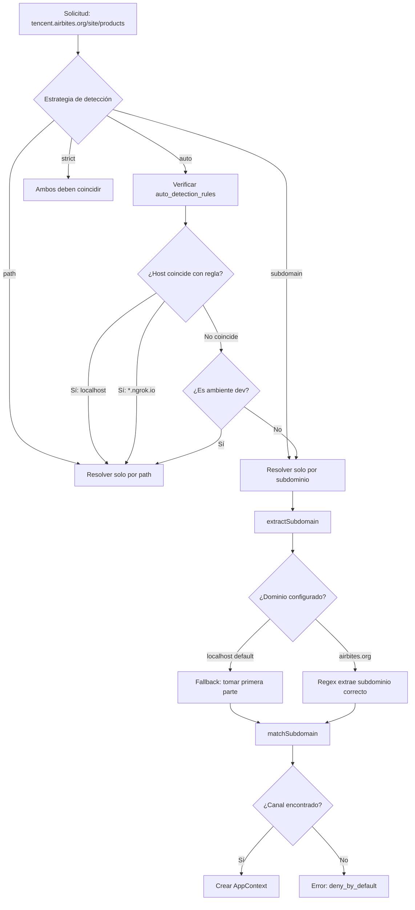

# Resumen de hallazgos del repositorio

- Nombre del paquete: `ronu/laravel-app-context` con soporte Laravel 11/12 y JWT vía `php-open-source-saver/jwt-auth`. El service provider es `Ronu\AppContext\AppContextServiceProvider`.
- Middleware incluidos: `app.context`, `app.auth`, `app.binding`, `app.scope`, `app.throttle`, `app.audit`, y el grupo `app-context`.
- La configuración está en `config/app-context.php` (canales, repositorio de clientes, JWT, API keys, rate limiting, seguridad, auditoría, rutas públicas).
- Almacenamiento: clientes en config o repositorios con base de datos (legacy `api_clients` o recomendado `api_apps` + `api_app_keys`).
- La verificación JWT incluye chequeo estricto de algoritmos y validación de audiencia/issuer; la verificación de API key usa headers `X-Client-Id` y `X-Api-Key` por defecto.

# Documentación

## 1) Título + Resumen de un párrafo

**Laravel App Context – Contexto multicanal + seguridad JWT/API Key**

Este paquete proporciona resolución determinista de contexto de aplicación (canal + tenant + modo de autenticación), orden de middleware estandarizado, integración JWT/API key y rate limiting/logging con contexto para Laravel 11/12. Resuelve el contexto solo desde host/path (nunca desde headers no firmados), vincula tokens a canal y tenant, y expone un objeto único `AppContext` para decisiones de autorización. Todo se registra vía `Ronu\AppContext\AppContextServiceProvider`, con configuración en `config/app-context.php`.

## 2) Inicio rápido (5–10 pasos)

1) Instala el paquete con Composer (ver Instalación).
2) Publica la configuración: `php artisan vendor:publish --tag=app-context-config`.
3) Configura `config/app-context.php` con canales (`mobile`, `admin`, `partner`) y su `auth_mode`.
4) Elige el driver de repositorio de clientes (`config` o `eloquent`).
5) Si usas `eloquent`, crea tablas `api_apps` + `api_app_keys` (o `api_clients` legacy).
6) Aplica el middleware en el orden correcto (ver Referencia de Middleware + Ejemplos por Canal).
7) Asegura que el login solo use `app.context` + rate limit y emita JWT con `aud` correcto.
8) Ejecuta `app.binding` después de JWT para validar audiencia/tenant.
9) Valida headers de API key (`X-Client-Id`, `X-Api-Key`) para B2B.
10) Verifica rate limits y auditoría en `config/app-context.php`.

## 3) Instalación

### Composer

```bash
composer require ronu/laravel-app-context
```

### Publicar configuración

```bash
php artisan vendor:publish --tag=app-context-config
```

### Auto-descubrimiento del Service Provider

Laravel auto-registra el provider vía `composer.json`. Si lo deshabilitas, agrégalo en tu app:

```php
// config/app.php
'providers' => [
    Ronu\AppContext\AppContextServiceProvider::class,
],
```

## 4) Arquitectura del paquete (diagrama Mermaid)

**Flujo de petición**

```mermaid
flowchart TD
    A[Solicitud Entrante] --> B[ResolveAppContext (host/path)]
    B --> C{Modo Auth}
    C -->|jwt| D[AuthenticateChannel: JWT]
    C -->|api_key| E[AuthenticateChannel: API Key]
    C -->|anonymous| F[AuthenticateChannel: Anonymous]
    D --> G[EnforceContextBinding]
    E --> G[EnforceContextBinding]
    F --> G[EnforceContextBinding]
    G --> H[RateLimitByContext]
    H --> I[InjectAuditContext]
    I --> J[RequireScope (por ruta)]
    J --> K[Controlador / Lógica]
```

## 5) Referencia de Middleware

> Los alias y el grupo `app-context` se registran en `Ronu\AppContext\AppContextServiceProvider` usando `Router::aliasMiddleware()` y `middlewareGroup()`.

| Middleware | Propósito | Dónde registrar | Orden | Aplica a |
|---|---|---|---|---|
| `app.context` | Resuelve canal + contexto base | Grupo de rutas (o `app-context`) | 1 | dashboard, mobile, b2b |
| `app.auth` | Autentica por canal (`jwt`, `api_key`, `anonymous`) | Grupo de rutas | 2 | dashboard, mobile, b2b |
| `app.binding` | Enforce de audiencia/tenant | Grupo de rutas | 3 | dashboard, mobile, b2b |
| `app.throttle` | Rate limit por contexto | Grupo de rutas | 4 | dashboard, mobile, b2b |
| `app.audit` | Inyecta contexto en logs | Grupo de rutas | 5 | dashboard, mobile, b2b |
| `app.scope` | Exige scopes/capabilities (OR) | Por ruta | Después de auth/binding | dashboard, mobile, b2b |

**Nota:** Existe `Ronu\AppContext\Middleware\RequireAllScopes`, pero no está aliasado por el provider. Si lo necesitas, regístralo (ver abajo).

### Opcional: alias para `RequireAllScopes` (lógica AND)

**Laravel 11/12 (`bootstrap/app.php`)**

```php
// bootstrap/app.php
->withMiddleware(function (Illuminate\Foundation\Configuration\Middleware $middleware) {
    $middleware->alias([
        'app.scope.all' => Ronu\AppContext\Middleware\RequireAllScopes::class,
    ]);
})
```

**Legacy (`app/Http/Kernel.php`)**

```php
// app/Http/Kernel.php
protected $routeMiddleware = [
    'app.scope.all' => Ronu\AppContext\Middleware\RequireAllScopes::class,
];
```

## 6) Configuración

Archivo: `config/app-context.php`.

### Claves principales

| Clave | Descripción | Default / Ejemplo |
|---|---|---|
| `client_repository.driver` | Backend (`config`, `eloquent` o clase custom) | `config` |
| `deny_by_default` | Bloquear si no hay match de canal | `true` |
| `default_channel` | Canal por defecto si no se bloquea | `default` |
| `domain` | Dominio base para subdominios | `APP_CONTEXT_DOMAIN` |
| `detection_strategy` | `auto`, `path`, `subdomain`, `strict` | `auto` |
| `auto_detection_rules` | Host → estrategia | ver archivo |
| `app_context_dev` | Envs que usan path por defecto | `local` |
| `channels` | Definición de canales | ver archivo |
| `rate_limits` | Profiles de rate limit | ver archivo |
| `jwt` | Verificación + fallback JWT | ver archivo |
| `api_key` | Headers, rotación y formato | ver archivo |
| `security` | Toggles de seguridad | ver archivo |
| `audit` | Logging | ver archivo |
| `public_routes` | Rutas públicas | ver archivo |

### Definición de canales (clave de seguridad)

Cada canal define:
- **`auth_mode`**: `jwt`, `api_key`, `anonymous`, `jwt_or_anonymous`.
- **`jwt_audience`**: `aud` esperado para JWT.
- **`allowed_scopes`** / **`allowed_capabilities`**: allow-list.
- **`tenant_mode`**: `single` o `multi`.

### Headers de API Key

Headers por defecto (configurable en `api_key.headers`):
- `X-Client-Id` → identificador (`app_code`)
- `X-Api-Key` → API key (`prefix.secret`)

### Configuración JWT para proxy inverso

Cuando tu aplicación está detrás de un proxy inverso (nginx, HAProxy, etc.) que termina SSL, el protocolo puede cambiar de `https` a `http` internamente. Esto causa que la validación del issuer falle porque las URLs no coinciden exactamente.

| Variable de entorno | Descripción | Default |
|---|---|---|
| `JWT_IGNORE_ISSUER_SCHEME` | Ignora el protocolo (http/https) al validar el issuer | `false` |

**Ejemplo de uso:**

```env
# .env
JWT_ISSUER=https://api.tumerkado.com
JWT_IGNORE_ISSUER_SCHEME=true
```

Con esta configuración, las siguientes URLs serán consideradas equivalentes:
- `https://api.tumerkado.com/admin/login`
- `http://api.tumerkado.com/admin/login`

### Defaults seguros

Defaults recomendados ya presentes:
- `deny_by_default = true`
- `security.strict_algorithm_check = true`
- `jwt.verify_aud = true` y `jwt.verify_iss = true`
- `api_key.hash_algorithm = argon2id`
- `security.enforce_tenant_binding = true`

## 7) Autenticación (JWT con php-open-source-saver/jwt-auth)

### Cambios en controlador (login/logout/refresh)

> El paquete **no** incluye AuthController. Si tu app ya lo tiene, conserva tus endpoints y agrega el binding de claims.

**Dónde ponerlo:** `app/Http/Controllers/AuthController.php`.

#### Login (JWT: bind de app context)

```php
use Illuminate\Http\Request;
use Illuminate\Support\Facades\Auth;
use PHPOpenSourceSaver\JWTAuth\Facades\JWTAuth;
use Ronu\AppContext\Context\AppContext;

public function login(Request $request, AppContext $context)
{
    $credentials = $request->only(['email', 'password']);

    if (! $token = Auth::attempt($credentials)) {
        return response()->json(['message' => 'Credenciales inválidas'], 401);
    }

    $claims = [
        'aud' => $context->getAppId(),
        'tid' => $request->header('X-Tenant-Id') ?? $request->route('tenant_id') ?? $request->query('tenant_id'),
        'scp' => [],
    ];

    $token = JWTAuth::claims($claims)->fromUser(Auth::user());

    return response()->json([
        'access_token' => $token,
        'token_type' => 'Bearer',
        'expires_in' => config('app-context.jwt.ttl'),
        'audience' => $context->getAppId(),
        'tenant_id' => $claims['tid'],
    ]);
}
```

#### Logout (invalida token)

```php
use PHPOpenSourceSaver\JWTAuth\Facades\JWTAuth;

public function logout()
{
    JWTAuth::invalidate(JWTAuth::getToken());

    return response()->json(['message' => 'Sesión cerrada']);
}
```

#### Refresh (refrescar token)

```php
use PHPOpenSourceSaver\JWTAuth\Facades\JWTAuth;

public function refresh()
{
    $newToken = JWTAuth::refresh(JWTAuth::getToken());

    return response()->json([
        'access_token' => $newToken,
        'token_type' => 'Bearer',
        'expires_in' => config('app-context.jwt.ttl'),
    ]);
}
```

### Ejemplos de rutas

**Grupo de login** (sin `app.auth`):

```php
// routes/api.php
Route::middleware([
    'app.context',
    'app.binding',
    'app.throttle',
    'app.audit',
])->post('/api/login', [AuthController::class, 'login']);
```

**Grupo autenticado**:

```php
Route::middleware([
    'app.context',
    'app.auth',
    'app.binding',
    'app.throttle',
    'app.audit',
])->group(function () {
    Route::get('/api/me', [AuthController::class, 'me']);
});
```

### Binding de claims en JWT (recomendado)

Incluye al menos:
- `aud`: canal (ej. `admin`, `mobile`, `site`)
- `tid`: tenant (si aplica)
- `scp`: scopes (si aplica)

`app.binding` valida `aud` y `tid`.

## 8) Ejemplos por canal

### dashboard (web client / SPA)

**Canal esperado**: `admin` (JWT)

```php
// routes/api.php
Route::prefix('api')->middleware([
    'app.context',
    'app.auth',
    'app.binding',
    'app.throttle',
    'app.audit',
])->group(function () {
    Route::get('/dashboard', [DashboardController::class, 'index'])
        ->middleware('app.scope:admin:dashboard:read');
});
```

### mobile

**Canal esperado**: `mobile` (JWT)

```php
// routes/api.php
Route::prefix('mobile')->middleware([
    'app.context',
    'app.auth',
    'app.binding',
    'app.throttle',
    'app.audit',
])->group(function () {
    Route::get('/orders', [OrderController::class, 'index'])
        ->middleware('app.scope:mobile:orders:read');
});
```

### b2b

**Canal esperado**: `partner` (API key)

```php
// routes/api.php
Route::prefix('partner')->middleware([
    'app.context',
    'app.auth',
    'app.binding',
    'app.throttle',
    'app.audit',
])->group(function () {
    Route::get('/inventory', [PartnerInventoryController::class, 'index'])
        ->middleware('app.scope:partner:inventory:read');
});
```

## 9) Configuración de Dominio y Resolución de Canales

Esta sección explica en detalle cómo el sistema detecta y resuelve canales basándose en el host y path de la solicitud. Es **crítica** para entender por qué una solicitud puede fallar con el error "Request does not match any configured channel".

### 9.1) El Flujo de Resolución de Canales



### 9.2) Configuración del Dominio Base

**Esta es la configuración más importante para producción.**

```php
// config/app-context.php línea 102
'domain' => env('APP_CONTEXT_DOMAIN', env('APP_DOMAIN', 'localhost')),
```

#### ¿Por qué es crítico configurarlo?

El método `extractSubdomain()` usa este valor para extraer el subdominio del host:

```php
// src/Context/ContextResolver.php líneas 162-166
$domain = preg_quote($this->domain, '/');
if (preg_match('/^([^.]+)\.' . $domain . '$/', $host, $matches)) {
    return $matches[1];  // El subdominio extraído
}
```

**Ejemplo con dominio MAL configurado (localhost por defecto):**

| Host | Dominio Config | Regex Generado | Resultado |
|------|----------------|----------------|-----------|
| `tencent.airbites.org` | `localhost` | `/^([^.]+)\.localhost$/` | ❌ NO COINCIDE |
| `admin.localhost` | `localhost` | `/^([^.]+)\.localhost$/` | ✅ `admin` |

**Ejemplo con dominio BIEN configurado:**

| Host | Dominio Config | Regex Generado | Resultado |
|------|----------------|----------------|-----------|
| `tencent.airbites.org` | `airbites.org` | `/^([^.]+)\.airbites\.org$/` | ✅ `tencent` |
| `www.airbites.org` | `airbites.org` | `/^([^.]+)\.airbites\.org$/` | ✅ `www` |

#### Configurar en .env

```env
# OBLIGATORIO para producción
APP_CONTEXT_DOMAIN=airbites.org

# O alternativamente
APP_DOMAIN=airbites.org
```

### 9.3) Estrategias de Detección

| Estrategia | Descripción | Cuándo usar |
|------------|-------------|-------------|
| `auto` | Inteligente: usa reglas para decidir | **Recomendado** - Maneja dev y prod |
| `path` | Solo usa prefijos de ruta (`/api/*`, `/mobile/*`) | Desarrollo local, ngrok |
| `subdomain` | Solo usa subdominios (`admin.`, `mobile.`) | Producción con subdominios |
| `strict` | Subdominio Y path deben coincidir | Máxima seguridad |

#### Reglas de Auto-Detección

```php
'auto_detection_rules' => [
    'localhost' => 'path',              // http://localhost/api → path
    '127.0.0.1' => 'path',              // http://127.0.0.1/mobile → path
    '*.localhost' => 'subdomain',       // http://api.localhost → subdomain
    '*.ngrok.io' => 'path',             // https://abc.ngrok.io/api → path
    '*.ngrok-free.app' => 'path',       // https://abc.ngrok-free.app → path
    '*.test' => 'path',                 // http://myapp.test/api → path
    '*.local' => 'path',                // http://myapp.local/api → path
    // Todos los demás hosts → 'subdomain' (producción)
],
```

#### Agregar regla para tu dominio personalizado

```php
'auto_detection_rules' => [
    // ... reglas existentes ...

    // Agregar tu dominio de producción
    '*.airbites.org' => 'subdomain',    // Usa subdominios
    // O si prefieres path:
    // '*.airbites.org' => 'path',      // Usa prefijos de ruta
],
```

### 9.4) Definición de Canales con Subdominios

```php
'channels' => [
    'site' => [
        // IMPORTANTE: Lista todos los subdominios que deben resolver a este canal
        'subdomains' => [
            'www',      // www.airbites.org
            'tencent',  // tencent.airbites.org
            'api',      // api.airbites.org
            null,       // airbites.org (dominio raíz sin subdominio)
        ],
        'path_prefixes' => ['/site', '/shop'],
        'auth_mode' => 'jwt_or_anonymous',
        'jwt_audience' => 'site',
        // ... resto de configuración
    ],

    'admin' => [
        'subdomains' => ['admin', 'dashboard'],
        'path_prefixes' => ['/api'],
        // ...
    ],
],
```

### 9.5) Escenarios Comunes y Soluciones

#### Escenario 1: Subdominio personalizado no funciona

**Problema:** `https://mitienda.airbites.org/site/products` → Error "Request does not match any configured channel"

**Diagnóstico:**
1. ¿Está configurado `APP_CONTEXT_DOMAIN=airbites.org`? ❌
2. ¿El canal tiene `'mitienda'` en `subdomains`? ❌

**Solución:**
```env
# .env
APP_CONTEXT_DOMAIN=airbites.org
```

```php
// config/app-context.php
'site' => [
    'subdomains' => ['www', 'mitienda', null],
    // ...
]
```

#### Escenario 2: Múltiples tenants con subdominios dinámicos

**Problema:** Cada tenant tiene su subdominio: `tenant1.airbites.org`, `tenant2.airbites.org`, etc.

**Solución:** Usar detección por `path` en lugar de `subdomain`:

```php
// config/app-context.php
'auto_detection_rules' => [
    // Forzar detección por path para tu dominio
    '*.airbites.org' => 'path',
],

'channels' => [
    'site' => [
        'subdomains' => [],  // No importa
        'path_prefixes' => ['/site', '/shop', '/'],  // Detectar por path
        // ...
    ],
],
```

#### Escenario 3: Desarrollo local vs Producción

**Problema:** En local uso `localhost/api` pero en producción `admin.airbites.org`

**Solución:** La estrategia `auto` ya maneja esto:

```env
# .env.local (desarrollo)
APP_ENV=local
APP_CONTEXT_DOMAIN=localhost
# Usará detección por path automáticamente

# .env.production (producción)
APP_ENV=production
APP_CONTEXT_DOMAIN=airbites.org
# Usará detección por subdomain automáticamente
```

#### Escenario 4: Ngrok o túnel de desarrollo

**Problema:** `https://abc123.ngrok-free.app/site/products` no funciona

**Solución:** Ngrok ya está configurado en `auto_detection_rules` para usar `path`:

```php
'auto_detection_rules' => [
    '*.ngrok-free.app' => 'path',  // Ya configurado
],
```

Solo asegúrate que tu canal tenga el path prefix correcto:
```php
'site' => [
    'path_prefixes' => ['/site'],  // Esto funcionará con ngrok
],
```

#### Escenario 5: Mismo código desplegado en múltiples dominios - uno funciona y otro no

**Problema:** Tienes el mismo código desplegado en dos dominios diferentes. En uno funciona perfectamente y en otro da error "Authentication required" o "Request does not match any configured channel".

**Ejemplo real:**
- ✅ `https://api.tumerkado.com/site/catalog/products` → **Funciona**
- ❌ `https://tencent.airbites.org/site/catalog/products` → **Error: "Authentication required"**

**¿Por qué ocurre esto?**

El comportamiento diferente se debe a que **cada dominio puede tener una estrategia de detección diferente** según las reglas de `auto_detection_rules`.

```
┌─────────────────────────────────────────────────────────────────────────────┐
│                    MISMO CÓDIGO, DIFERENTES RESULTADOS                       │
├─────────────────────────────────────────────────────────────────────────────┤
│                                                                              │
│  api.tumerkado.com/site/products          tencent.airbites.org/site/products│
│           │                                          │                       │
│           ▼                                          ▼                       │
│  ¿Hay regla para *.tumerkado.com?         ¿Hay regla para *.airbites.org?   │
│           │                                          │                       │
│      SÍ: 'path'                               NO (usa default)              │
│           │                                          │                       │
│           ▼                                          ▼                       │
│  Detecta por PATH: /site                  Detecta por SUBDOMAIN: tencent    │
│           │                                          │                       │
│           ▼                                          ▼                       │
│  Canal: 'site' ✅                          ¿Canal con 'tencent'?            │
│  allow_anonymous: true                              │                        │
│           │                                    NO encontrado                 │
│           ▼                                          │                       │
│      FUNCIONA ✅                                     ▼                       │
│                                              Canal: null o incorrecto       │
│                                              allow_anonymous: false          │
│                                                      │                       │
│                                                      ▼                       │
│                                          ERROR: Authentication required ❌   │
│                                                                              │
└─────────────────────────────────────────────────────────────────────────────┘
```

**Diagnóstico paso a paso:**

1. **Verifica las reglas de auto-detección** en tu `config/app-context.php`:
   ```php
   'auto_detection_rules' => [
       '*.tumerkado.com' => 'path',    // ✅ Tiene regla → usa path
       // *.airbites.org NO tiene regla → usa subdomain por defecto
   ],
   ```

2. **Cuando no hay regla**, el sistema usa `subdomain` por defecto en producción
3. **Con estrategia `subdomain`**, busca el canal por el subdominio (`tencent`)
4. **Si el subdominio no está en ningún canal**, falla o resuelve a un canal incorrecto

**Solución 1: Agregar regla para el dominio que falla**

```php
// config/app-context.php
'auto_detection_rules' => [
    'localhost' => 'path',
    '127.0.0.1' => 'path',
    '*.localhost' => 'subdomain',
    '*.ngrok.io' => 'path',
    '*.ngrok-free.app' => 'path',
    '*.test' => 'path',
    '*.local' => 'path',

    // ✅ AGREGAR REGLAS PARA TUS DOMINIOS DE PRODUCCIÓN
    '*.tumerkado.com' => 'path',     // Ya funcionaba
    '*.airbites.org' => 'path',      // ← AGREGAR ESTA LÍNEA
],
```

**Solución 2: Usar estrategia `path` global**

Si todos tus dominios deben usar detección por path:

```env
# .env
APP_CONTEXT_DETECTION=path
```

**Solución 3: Agregar todos los subdominios posibles al canal**

Si prefieres mantener la estrategia `subdomain`:

```php
// config/app-context.php
'channels' => [
    'site' => [
        'subdomains' => [
            'www',
            'api',        // Para api.tumerkado.com
            'tencent',    // Para tencent.airbites.org
            'store',      // Otros subdominios que uses
            null,         // Dominio raíz
        ],
        'path_prefixes' => ['/site', '/shop'],
        'auth_mode' => 'jwt_or_anonymous',
        'features' => [
            'allow_anonymous' => true,  // ✅ CRÍTICO para acceso sin JWT
        ],
    ],
],
```

**Tabla de referencia rápida:**

| Configuración | api.tumerkado.com/site | tencent.airbites.org/site |
|---------------|------------------------|---------------------------|
| Sin reglas | subdomain → busca 'api' | subdomain → busca 'tencent' |
| `*.tumerkado.com => 'path'` | path → busca '/site' ✅ | subdomain → busca 'tencent' ❌ |
| Ambos con regla 'path' | path → '/site' ✅ | path → '/site' ✅ |
| `APP_CONTEXT_DETECTION=path` | path → '/site' ✅ | path → '/site' ✅ |

**Recomendación para multi-dominio:**

Si despliegas el mismo código en múltiples dominios con subdominios dinámicos (multi-tenant), **usa siempre detección por `path`**:

```php
// config/app-context.php
'auto_detection_rules' => [
    // Desarrollo
    'localhost' => 'path',
    '127.0.0.1' => 'path',
    '*.test' => 'path',
    '*.local' => 'path',
    '*.ngrok-free.app' => 'path',

    // Producción - TODOS tus dominios
    '*.tumerkado.com' => 'path',
    '*.airbites.org' => 'path',
    '*.tuotrodominio.com' => 'path',
],
```

Esto garantiza que el canal se determine por el **path de la URL** (`/site`, `/api`, `/mobile`) y no por el subdominio, permitiendo que cualquier subdominio funcione correctamente.

### 9.6) Debugging de Resolución de Canales

Para diagnosticar problemas, puedes crear un endpoint de prueba:

```php
// routes/web.php (solo para debugging)
Route::get('/debug-context', function (\Illuminate\Http\Request $request) {
    $resolver = app(\Ronu\AppContext\Contracts\ContextResolverInterface::class);

    $host = $request->getHost();
    $path = '/' . ltrim($request->path(), '/');

    return response()->json([
        'host' => $host,
        'path' => $path,
        'configured_domain' => config('app-context.domain'),
        'detection_strategy' => config('app-context.detection_strategy'),
        'extracted_subdomain' => $resolver->extractSubdomain($host),
        'matched_path_channel' => $resolver->matchPathPrefix($path),
        'effective_strategy' => $resolver->getDetectionStrategy($host),
        'channels_configured' => array_keys(config('app-context.channels')),
    ]);
});
```

**Respuesta de ejemplo:**
```json
{
    "host": "tencent.airbites.org",
    "path": "/site/catalog/products",
    "configured_domain": "localhost",  // ❌ PROBLEMA: debería ser "airbites.org"
    "detection_strategy": "auto",
    "extracted_subdomain": "tencent",  // Funciona por fallback multi-level
    "matched_path_channel": "site",
    "effective_strategy": "subdomain",
    "channels_configured": ["mobile", "admin", "site", "partner"]
}
```

### 9.7) Checklist de Configuración de Dominio

- [ ] `APP_CONTEXT_DOMAIN` configurado en `.env` con tu dominio de producción
- [ ] Todos los subdominios listados en el canal correspondiente
- [ ] `null` incluido en `subdomains` si quieres soportar el dominio raíz
- [ ] Regla en `auto_detection_rules` si necesitas comportamiento especial
- [ ] `php artisan config:clear` ejecutado después de cambios

## 10) Solución de problemas

- **"AppContext not resolved"** → Asegura que `app.context` es el primero.
- **"Request does not match any configured channel"** → Verifica:
  1. `APP_CONTEXT_DOMAIN` está configurado correctamente
  2. El subdominio está listado en el array `subdomains` del canal
  3. El path prefix coincide si usas detección por path
  4. Ejecuta `php artisan config:clear` después de cambios
- **JWT audience mismatch** → El login debe emitir tokens con `aud` correcto.
- **JWT issuer mismatch con proxy inverso** → Si usas un proxy inverso que cambia el protocolo (ej. nginx con SSL termination), el issuer del token (`https://`) puede no coincidir con la URL interna (`http://`). Solución: configura `JWT_IGNORE_ISSUER_SCHEME=true` en tu `.env`.
- **Errores de tenant** → Enviar `tenant_id` por ruta, query o header `X-Tenant-Id`.
- **API key inválida** → Verifica `X-Client-Id` + `X-Api-Key` y hash.

## 11) Checklist de seguridad

- [ ] `deny_by_default = true` en producción.
- [ ] `jwt.verify_aud = true` y `jwt.verify_iss = true`.
- [ ] Tokens incluyen `aud` y `tid`.
- [ ] API keys hasheadas con Argon2id/Bcrypt.
- [ ] IP allowlist en partners críticos.
- [ ] Auditoría de fallos de auth.
- [ ] Rate limits por canal/endpoint.

## 12) Notas de changelog (breaking changes / upgrade tips)

N/A (no se encontró changelog en el repo).
