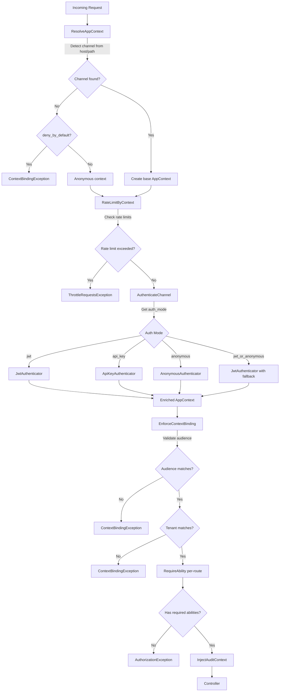
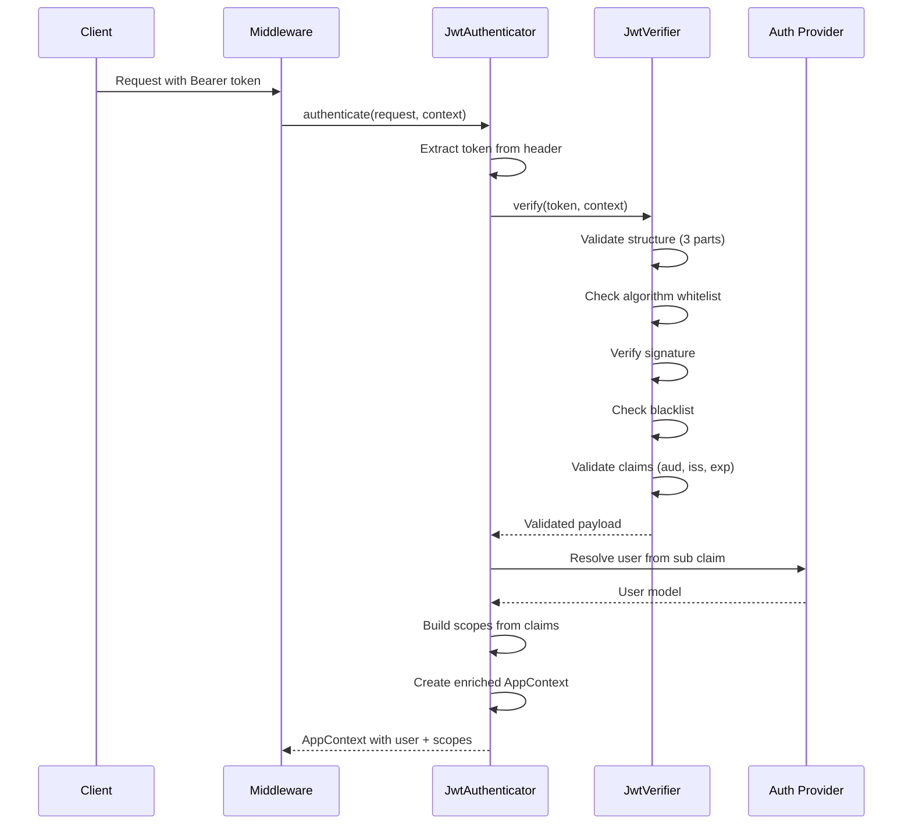
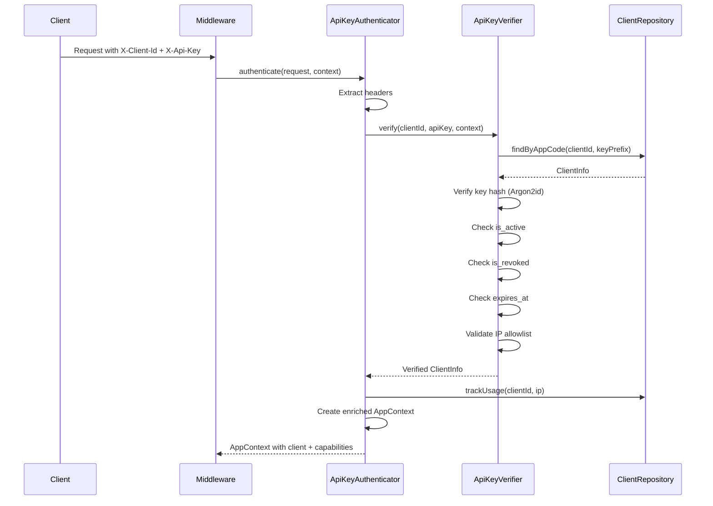

# Laravel App Context

[](https://packagist.org/packages/ronu/laravel-app-context)
[](https://packagist.org/packages/ronu/laravel-app-context)
[](https://packagist.org/packages/ronu/laravel-app-context)

**Multi-channel application context management for Laravel with JWT and API Key authentication.**

> **Documentation:** [Spanish (Español)](README.es.md) | [Architecture](ARCHITECTURE.md) | [Security](SECURITY.md) | [Migration](MIGRATION.md) | [Examples](EXAMPLES.md)

---

## Table of Contents

1. [Introduction](#introduction)
2. [Why Laravel App Context?](#why-laravel-app-context)
3. [Key Features](#key-features)
4. [Requirements](#requirements)
5. [Installation](#installation)
6. [Quick Start (10 minutes)](#quick-start-10-minutes)
7. [Core Concepts](#core-concepts)
8. [Architecture](#architecture)
9. [Configuration Reference](#configuration-reference)
10. [Middleware Pipeline](#middleware-pipeline)
11. [Authentication Flows](#authentication-flows)
12. [Client Repository](#client-repository)
13. [Rate Limiting](#rate-limiting)
14. [Security Features](#security-features)
15. [Artisan Commands](#artisan-commands)
16. [Testing](#testing)
17. [Troubleshooting](#troubleshooting)
18. [FAQ](#faq)
19. [Glossary](#glossary)
20. [License](#license)

---

## Introduction

**Laravel App Context** is a comprehensive multi-channel authentication and authorization library for Laravel 11/12 applications. It provides a unified approach to managing different application contexts (mobile apps, admin dashboards, partner APIs, public websites) with distinct authentication modes, scopes, and security policies.

The library introduces the concept of an **AppContext** - an immutable value object that encapsulates all authentication and authorization state for a request, including the channel, user identity, tenant, scopes, capabilities, and metadata. This context flows through your entire application, enabling consistent authorization decisions and audit logging.

Unlike traditional Laravel authentication that treats all API requests uniformly, Laravel App Context recognizes that modern applications serve multiple clients with different security requirements. A mobile app might need JWT authentication with device binding, while a B2B partner integration requires API keys with IP allowlists.

---

## Why Laravel App Context?

### The Problem

Modern applications typically serve multiple clients:
- **Mobile apps** requiring JWT with refresh tokens and device fingerprinting
- **Admin dashboards** needing strict audience binding and audit trails
- **Partner APIs** using API keys with IP restrictions and capability-based access
- **Public websites** with optional authentication and anonymous access

Laravel's native authentication handles single-context scenarios well, but becomes complex when you need:
- Different authentication modes per route group
- Channel-specific rate limiting
- Multi-tenant isolation with token binding
- Unified audit logging across all authentication types
- Protection against token reuse across channels

### The Solution

Laravel App Context provides:

| Challenge | Solution |
|-----------|----------|
| Multiple auth modes | Channel-based authentication (JWT, API Key, Anonymous) |
| Token reuse attacks | Audience binding validates token's intended channel |
| Multi-tenant isolation | Tenant binding in JWT claims with enforcement |
| Complex rate limiting | Context-aware rate limiting per channel/endpoint |
| Audit complexity | Automatic context injection into all logs |
| Permission management | Unified scopes (JWT) and capabilities (API Key) |

### When to Use (and When Not To)

**Use Laravel App Context when:**
- Your API serves multiple client types (mobile, web, partners)
- You need different authentication modes per client type
- Multi-tenant isolation is required
- B2B integrations need API key management
- You want unified audit logging across all auth types

**Consider alternatives when:**
- Single authentication mode is sufficient
- No multi-tenant requirements
- Simple API without channel separation
- Laravel Sanctum/Passport meets all your needs

---

## Key Features

### Authentication
- **Multi-Auth Support**: JWT, API Key, and Anonymous authentication
- **Channel-Based Routing**: Auto-detect channels from subdomain or path
- **Optional JWT Mode**: `jwt_or_anonymous` for public-with-optional-auth routes

### Authorization
- **Scope System**: JWT scopes with wildcard support (`admin:*`)
- **Capability System**: API Key capabilities for B2B partners
- **Unified Abilities**: Check scopes OR capabilities with single API

### Security
- **Algorithm Confusion Prevention**: Rejects `none` algorithm (CVE-2015-9235)
- **Audience Binding**: Tokens locked to their intended channel
- **Tenant Binding**: Prevents cross-tenant access
- **IP Allowlists**: CIDR notation support for API keys
- **Token Blacklist**: Redis-backed JWT invalidation

### Operations
- **Context-Aware Rate Limiting**: Per-channel and per-endpoint limits
- **Audit Logging**: Automatic context injection into all logs
- **Usage Tracking**: API key usage statistics (async optional)

### Flexibility
- **Repository Pattern**: Config, Eloquent, or custom client storage
- **Middleware Composition**: Granular middleware for custom pipelines
- **Extensible**: Custom authenticators and verifiers

---

## Requirements

- **PHP**: 8.2+
- **Laravel**: 11.0+ or 12.0+
- **JWT Library**: `php-open-source-saver/jwt-auth` 2.0+
- **Optional**: Redis for token blacklist and rate limiting

---

## Installation

### Step 1: Install via Composer

```bash
composer require ronu/laravel-app-context
```

### Step 2: Publish Configuration

```bash
php artisan vendor:publish --tag=app-context-config
```

This creates `config/app-context.php` with all configuration options.

### Step 3: Configure JWT (if using JWT authentication)

If not already configured, set up JWT authentication:

```bash
# Generate JWT secret (for HS256)
php artisan jwt:secret

# Or generate RSA keys (recommended for production)
mkdir -p storage/jwt
openssl genrsa -out storage/jwt/private.pem 4096
openssl rsa -in storage/jwt/private.pem -pubout -out storage/jwt/public.pem
```

### Step 4: Configure Environment

```env
# Core
APP_CONTEXT_DOMAIN=myapp.com
APP_CONTEXT_DENY_BY_DEFAULT=true

# JWT
JWT_ALGO=RS256
JWT_PUBLIC_KEY_PATH=storage/jwt/public.pem
JWT_PRIVATE_KEY_PATH=storage/jwt/private.pem
JWT_ISSUER=https://myapp.com
JWT_TTL=3600

# API Key (if using)
API_KEY_HASH_ALGO=argon2id
```

### Step 5: Database Setup (if using Eloquent driver)

If managing API clients via database, create the migrations:

```bash
php artisan make:migration create_api_apps_table
php artisan make:migration create_api_app_keys_table
```

See [Client Repository](#client-repository) section for migration examples.

---

## Quick Start (10 minutes)

This guide gets you from zero to a working protected API in 10 minutes.

### 1. Configure a Channel

Edit `config/app-context.php`:

```php
'channels' => [
    'mobile' => [
        'subdomains' => ['mobile', 'm'],
        'path_prefixes' => ['/mobile'],
        'auth_mode' => 'jwt',
        'jwt_audience' => 'mobile',
        'allowed_scopes' => ['mobile:*', 'user:profile:*'],
        'rate_limit_profile' => 'mobile',
    ],
],
```

### 2. Create Protected Routes

```php
// routes/api.php
use App\Http\Controllers\UserController;

Route::middleware(['app-context'])->prefix('mobile')->group(function () {
    Route::get('/profile', [UserController::class, 'profile'])
        ->middleware('app.requires:user:profile:read');
});
```

### 3. Create Login Route (without app.auth)

```php
// routes/api.php
use App\Http\Controllers\AuthController;

Route::middleware([
    'app.context',
    'app.throttle',
    'app.binding',
])->prefix('mobile')->group(function () {
    Route::post('/login', [AuthController::class, 'login']);
});
```

### 4. Implement Login Controller

```php
<?php

namespace App\Http\Controllers;

use Illuminate\Http\Request;
use Illuminate\Support\Facades\Auth;
use PHPOpenSourceSaver\JWTAuth\Facades\JWTAuth;
use Ronu\AppContext\Context\AppContext;

class AuthController extends Controller
{
    public function login(Request $request, AppContext $context)
    {
        $credentials = $request->validate([
            'email' => 'required|email',
            'password' => 'required',
        ]);

        if (!Auth::attempt($credentials)) {
            return response()->json(['message' => 'Invalid credentials'], 401);
        }

        // Bind context to JWT claims
        $claims = [
            'aud' => $context->getAppId(),  // Channel: 'mobile'
            'tid' => $request->header('X-Tenant-Id'),
            'scp' => ['mobile:*', 'user:profile:*'],
        ];

        $token = JWTAuth::claims($claims)->fromUser(Auth::user());

        return response()->json([
            'access_token' => $token,
            'token_type' => 'Bearer',
            'expires_in' => config('app-context.jwt.ttl'),
        ]);
    }
}
```

### 5. Implement Protected Controller

```php
<?php

namespace App\Http\Controllers;

use Ronu\AppContext\Context\AppContext;

class UserController extends Controller
{
    public function profile(AppContext $context)
    {
        // Context is automatically injected
        $context->requires('user:profile:read');

        return response()->json([
            'user_id' => $context->getUserId(),
            'channel' => $context->getAppId(),
            'tenant' => $context->getTenantId(),
        ]);
    }
}
```

### 6. Test the Endpoint

```bash
# Login
curl -X POST "https://mobile.myapp.com/mobile/login" \
  -H "Content-Type: application/json" \
  -d '{"email":"user@example.com","password":"secret"}'

# Response: {"access_token":"eyJ...", "token_type":"Bearer", "expires_in":3600}

# Access protected endpoint
curl -X GET "https://mobile.myapp.com/mobile/profile" \
  -H "Authorization: Bearer eyJ..."

# Response: {"user_id":1, "channel":"mobile", "tenant":null}
```

**Congratulations!** You have a working protected API with channel-bound JWT authentication.

---

## Core Concepts

### AppContext

The `AppContext` is an immutable value object that represents all authentication and authorization state for a request:

```php
use Ronu\AppContext\Context\AppContext;

$context = AppContext::current();

// Identity
$context->getAppId();       // Channel: 'mobile', 'admin', 'partner'
$context->getAuthMode();    // 'jwt', 'api_key', 'anonymous'
$context->getUserId();      // User ID from JWT
$context->getClientId();    // API client ID
$context->getTenantId();    // Tenant ID for multi-tenant apps

// Permissions
$context->getScopes();      // JWT scopes: ['admin:users:read']
$context->getCapabilities();// API Key capabilities: ['partner:orders:*']

// Metadata
$context->getDeviceId();    // Device fingerprint (mobile)
$context->getIpAddress();   // Client IP
$context->getRequestId();   // Unique request ID
$context->getMetadata();    // Additional context data
```

### Channels

Channels represent different client types with their own authentication and authorization rules:

| Channel | Auth Mode | Use Case |
|---------|-----------|----------|
| `mobile` | JWT | Mobile applications |
| `admin` | JWT | Admin dashboards, SPAs |
| `site` | JWT or Anonymous | Public websites |
| `partner` | API Key | B2B integrations |

Each channel defines:
- **Detection**: How to identify requests (subdomain, path prefix)
- **Authentication**: JWT, API Key, or Anonymous
- **Authorization**: Allowed scopes/capabilities
- **Rate Limiting**: Channel-specific limits

### Authentication Modes

| Mode | Credentials | Use Case |
|------|-------------|----------|
| `jwt` | Bearer token | User authentication |
| `api_key` | X-Client-Id + X-Api-Key headers | Machine-to-machine |
| `anonymous` | None | Public endpoints |
| `jwt_or_anonymous` | Optional Bearer token | Public with optional auth |

### Scopes vs Capabilities

Both represent permissions, but serve different contexts:

**Scopes** (JWT):
- Embedded in JWT tokens
- User-centric permissions
- Example: `admin:users:read`, `mobile:orders:create`

**Capabilities** (API Key):
- Configured per API client
- Client/application-centric permissions
- Example: `partner:inventory:read`, `webhooks:send`

**Abilities** (Unified):
- Check either scopes OR capabilities
- Use when permission could come from either source

```php
// Check specific type
$context->hasScope('admin:users:read');
$context->hasCapability('partner:orders:*');

// Check either (unified)
$context->hasAbility('catalog:browse');
```

### Wildcard Permissions

Both scopes and capabilities support wildcards:

```php
// Scope 'admin:*' matches:
$context->hasScope('admin:users:read');   // true
$context->hasScope('admin:settings');     // true
$context->hasScope('mobile:users:read');  // false
```

### Tenant Binding

For multi-tenant applications, the library enforces tenant isolation:

1. JWT includes `tid` (tenant ID) claim
2. Middleware extracts tenant from route/header/query
3. `app.binding` validates they match
4. Prevents cross-tenant access attacks

```php
// JWT claim: tid: "tenant_123"
// Request to: /api/tenant_456/users
// Result: ContextBindingException (tenant mismatch)
```

---

## Architecture

### Component Overview

```
┌─────────────────────────────────────────────────────────────────┐
│                        Laravel Application                       │
├─────────────────────────────────────────────────────────────────┤
│  Middleware Pipeline                                             │
│  ┌─────────────┐ ┌─────────────┐ ┌─────────────┐ ┌────────────┐ │
│  │ Resolve     │→│ RateLimit   │→│ Authenticate│→│ Enforce    │ │
│  │ AppContext  │ │ ByContext   │ │ Channel     │ │ Binding    │ │
│  └─────────────┘ └─────────────┘ └─────────────┘ └────────────┘ │
│         │                              │                         │
│         ▼                              ▼                         │
│  ┌─────────────┐               ┌─────────────┐                  │
│  │ Context     │               │ Authenticators │                │
│  │ Resolver    │               │ ├─ JWT         │                │
│  └─────────────┘               │ ├─ API Key     │                │
│                                │ └─ Anonymous   │                │
│                                └─────────────┘                  │
│                                       │                          │
│                                       ▼                          │
│                                ┌─────────────┐                  │
│                                │ Verifiers    │                  │
│                                │ ├─ JWT       │                  │
│                                │ └─ API Key   │                  │
│                                └─────────────┘                  │
│                                       │                          │
│                                       ▼                          │
│                                ┌─────────────┐                  │
│                                │ Client      │                  │
│                                │ Repository  │                  │
│                                └─────────────┘                  │
└─────────────────────────────────────────────────────────────────┘
```

### Request Flow



### JWT Authentication Flow



### API Key Authentication Flow



For detailed architecture documentation, see [ARCHITECTURE.md](ARCHITECTURE.md).

---

## Configuration Reference

The configuration file `config/app-context.php` contains all settings. Here are the key sections:

### Client Repository

```php
'client_repository' => [
    // Driver: 'config', 'eloquent', or custom class
    'driver' => env('APP_CONTEXT_CLIENT_DRIVER', 'config'),

    // Config driver settings (no database)
    'config' => [
        'hash_algorithm' => 'bcrypt',
        'clients' => [
            'acme-corp' => [
                'name' => 'ACME Corporation',
                'key_hash' => '$2y$10$...',
                'channel' => 'partner',
                'capabilities' => ['partner:*'],
                'ip_allowlist' => ['203.0.113.0/24'],
            ],
        ],
    ],

    // Eloquent driver settings (database)
    'eloquent' => [
        'apps_table' => 'api_apps',
        'app_keys_table' => 'api_app_keys',
        'hash_algorithm' => 'argon2id',
        'async_tracking' => true,
    ],
],
```

### Channels

```php
'channels' => [
    'mobile' => [
        'subdomains' => ['mobile', 'm'],
        'path_prefixes' => ['/mobile'],
        'auth_mode' => 'jwt',
        'jwt_audience' => 'mobile',
        'allowed_scopes' => ['mobile:*', 'user:profile:*'],
        'rate_limit_profile' => 'mobile',
        'tenant_mode' => 'single',
        'features' => ['push_notifications' => true],
    ],

    'admin' => [
        'subdomains' => ['admin', 'dashboard'],
        'path_prefixes' => ['/api'],
        'auth_mode' => 'jwt',
        'jwt_audience' => 'admin',
        'allowed_scopes' => ['admin:*'],
        'rate_limit_profile' => 'admin',
    ],

    'partner' => [
        'subdomains' => ['api-partners'],
        'path_prefixes' => ['/partner'],
        'auth_mode' => 'api_key',
        'allowed_capabilities' => ['partner:*'],
        'rate_limit_profile' => 'partner',
    ],

    'site' => [
        'subdomains' => ['www', null],
        'path_prefixes' => ['/site'],
        'auth_mode' => 'jwt_or_anonymous',
        'allowed_scopes' => ['site:*', 'catalog:browse'],
        'public_scopes' => ['catalog:browse', 'public:read'],
        'anonymous_on_invalid_token' => false,
    ],
],
```

### JWT Settings

```php
'jwt' => [
    'algorithm' => env('JWT_ALGO', 'RS256'),
    'public_key_path' => env('JWT_PUBLIC_KEY_PATH'),
    'private_key_path' => env('JWT_PRIVATE_KEY_PATH'),
    'issuer' => env('JWT_ISSUER'),
    'ttl' => env('JWT_TTL', 3600),
    'refresh_ttl' => env('JWT_REFRESH_TTL', 1209600),
    'blacklist_enabled' => env('JWT_BLACKLIST_ENABLED', true),
    'blacklist_grace_period' => 30,
    'verify_iss' => true,
    'verify_aud' => true,
    'allowed_algorithms' => ['HS256', 'RS256', 'RS384', 'RS512'],
    'token_sources' => ['header', 'query', 'cookie'],

    'dev_fallback' => [
        'enabled' => env('JWT_DEV_FALLBACK', false),
        'algorithm' => 'HS256',
        'secret' => env('JWT_DEV_SECRET', env('APP_KEY')),
    ],
],
```

### Rate Limiting

```php
'rate_limits' => [
    'mobile' => [
        'global' => '60/m',
        'authenticated_global' => '100/m',
        'by' => 'user_device',
        'burst' => '10/s',
        'endpoints' => [
            'POST:/mobile/orders' => '10/m',
            'POST:/mobile/checkout' => '5/m',
        ],
    ],

    'admin' => [
        'global' => '120/m',
        'by' => 'user',
        'endpoints' => [
            'POST:/api/export' => '5/h',
        ],
    ],

    'partner' => [
        'global' => '600/m',
        'by' => 'client_id',
        'endpoints' => [
            'POST:/partner/bulk-import' => '10/h',
        ],
    ],
],
```

### Security Settings

```php
'security' => [
    'strict_algorithm_check' => true,
    'enforce_tenant_binding' => true,
    'enforce_ip_allowlist' => env('APP_CONTEXT_IP_ALLOWLIST', false),
    'anomaly_detection' => [
        'enabled' => false,
        'max_ip_changes_per_hour' => 3,
        'max_device_changes_per_day' => 5,
    ],
],
```

### Audit Settings

```php
'audit' => [
    'enabled' => true,
    'log_channel' => null,
    'include_request_body' => false,
    'include_response_body' => false,
    'log_all_requests' => false,
    'log_failed_auth' => true,
    'sensitive_headers' => [
        'Authorization',
        'X-Api-Key',
        'Cookie',
        'X-CSRF-Token',
    ],
],
```

### Environment Variables

```env
# Core
APP_CONTEXT_DOMAIN=myapp.com
APP_CONTEXT_DETECTION=auto
APP_CONTEXT_DENY_BY_DEFAULT=true

# Client Repository
APP_CONTEXT_CLIENT_DRIVER=config
APP_CONTEXT_CLIENTS_TABLE=api_clients
APP_CONTEXT_APPS_TABLE=api_apps
APP_CONTEXT_APP_KEYS_TABLE=api_app_keys

# JWT
JWT_ALGO=RS256
JWT_PUBLIC_KEY_PATH=storage/jwt/public.pem
JWT_PRIVATE_KEY_PATH=storage/jwt/private.pem
JWT_ISSUER=https://myapp.com
JWT_TTL=3600
JWT_BLACKLIST_ENABLED=true
JWT_DEV_FALLBACK=false

# API Key
API_KEY_HASH_ALGO=argon2id
API_KEY_ROTATION_DAYS=90
APP_CONTEXT_IP_ALLOWLIST=false
```

---

## Middleware Pipeline

The package provides granular middleware that can be composed for different scenarios:

### Available Middleware

| Alias | Class | Purpose |
|-------|-------|---------|
| `app.context` | `ResolveAppContext` | Detect channel and create base context |
| `app.throttle` | `RateLimitByContext` | Context-aware rate limiting |
| `app.auth` | `AuthenticateChannel` | Authenticate based on channel mode |
| `app.binding` | `EnforceContextBinding` | Validate audience and tenant binding |
| `app.requires` | `RequireAbility` | Check scopes/capabilities (OR logic) |
| `app.requires.all` | `RequireAllAbilities` | Check scopes/capabilities (AND logic) |
| `app.scope` | `RequireScope` | Legacy scope checking |
| `app.audit` | `InjectAuditContext` | Inject context into logs |

### Middleware Group

The `app-context` group includes all middleware in the recommended order:

```php
// Equivalent to:
Route::middleware([
    'app.context',
    'app.throttle',
    'app.auth',
    'app.binding',
    'app.audit',
])->group(function () {
    // Routes
});
```

### Recommended Order

```
1. app.context      - Must be first (resolves channel)
2. app.throttle     - Rate limit before expensive operations
3. app.auth         - Authenticate the request
4. app.binding      - Validate audience/tenant binding
5. app.requires     - Check permissions (per-route)
6. app.audit        - Last (includes all context)
```

### Usage Examples

**Standard Protected Routes:**

```php
Route::middleware(['app-context'])->group(function () {
    Route::get('/users', [UserController::class, 'index'])
        ->middleware('app.requires:admin:users:read');
});
```

**Login Routes (no auth):**

```php
Route::middleware([
    'app.context',
    'app.throttle',
    'app.binding',
    'app.audit',
])->post('/login', [AuthController::class, 'login']);
```

**Multiple Required Scopes (OR):**

```php
Route::middleware(['app.requires:admin:users:read,admin:users:write'])
    ->get('/users', [UserController::class, 'index']);
// Passes if user has EITHER scope
```

**Multiple Required Scopes (AND):**

```php
Route::middleware(['app.requires.all:admin:users:read,admin:users:write'])
    ->put('/users/{id}', [UserController::class, 'update']);
// Passes only if user has BOTH scopes
```

---

## Authentication Flows

### JWT Authentication (User Login)

**Route Configuration:**

```php
// Login route (without app.auth)
Route::middleware([
    'app.context',
    'app.throttle',
    'app.binding',
])->post('/api/login', [AuthController::class, 'login']);

// Protected routes (with app.auth)
Route::middleware(['app-context'])->group(function () {
    Route::get('/api/me', [AuthController::class, 'me']);
    Route::post('/api/logout', [AuthController::class, 'logout']);
    Route::post('/api/refresh', [AuthController::class, 'refresh']);
});
```

**AuthController Implementation:**

```php
<?php

namespace App\Http\Controllers;

use Illuminate\Http\Request;
use Illuminate\Http\JsonResponse;
use Illuminate\Support\Facades\Auth;
use PHPOpenSourceSaver\JWTAuth\Facades\JWTAuth;
use Ronu\AppContext\Context\AppContext;

class AuthController extends Controller
{
    /**
     * Login and issue JWT with context claims.
     */
    public function login(Request $request, AppContext $context): JsonResponse
    {
        $credentials = $request->validate([
            'email' => 'required|email',
            'password' => 'required|string',
        ]);

        if (!Auth::attempt($credentials)) {
            return response()->json([
                'error' => 'AUTHENTICATION_FAILED',
                'message' => 'Invalid credentials',
            ], 401);
        }

        $user = Auth::user();

        // Build claims with context binding
        $claims = [
            'aud' => $context->getAppId(),  // Channel binding
            'tid' => $this->extractTenantId($request),  // Tenant binding
            'scp' => $this->getUserScopes($user, $context),
            'did' => $request->header('X-Device-Id'),  // Device binding (mobile)
        ];

        $token = JWTAuth::claims($claims)->fromUser($user);

        return response()->json([
            'access_token' => $token,
            'token_type' => 'Bearer',
            'expires_in' => config('app-context.jwt.ttl'),
            'audience' => $context->getAppId(),
            'tenant_id' => $claims['tid'],
        ]);
    }

    /**
     * Logout and invalidate token.
     */
    public function logout(): JsonResponse
    {
        JWTAuth::invalidate(JWTAuth::getToken());

        return response()->json(['message' => 'Logged out successfully']);
    }

    /**
     * Refresh token preserving claims.
     */
    public function refresh(): JsonResponse
    {
        $newToken = JWTAuth::refresh(JWTAuth::getToken());

        return response()->json([
            'access_token' => $newToken,
            'token_type' => 'Bearer',
            'expires_in' => config('app-context.jwt.ttl'),
        ]);
    }

    /**
     * Get current user info.
     */
    public function me(AppContext $context): JsonResponse
    {
        return response()->json([
            'user_id' => $context->getUserId(),
            'channel' => $context->getAppId(),
            'tenant_id' => $context->getTenantId(),
            'scopes' => $context->getScopes(),
        ]);
    }

    private function extractTenantId(Request $request): ?string
    {
        return $request->header('X-Tenant-Id')
            ?? $request->route('tenant_id')
            ?? $request->query('tenant_id');
    }

    private function getUserScopes($user, AppContext $context): array
    {
        // Get user permissions and filter by channel's allowed scopes
        $userPermissions = method_exists($user, 'getPermissions')
            ? $user->getPermissions()
            : [];

        $channelScopes = config("app-context.channels.{$context->getAppId()}.allowed_scopes", []);

        return array_intersect($userPermissions, $channelScopes);
    }
}
```

### API Key Authentication (Machine-to-Machine)

API Key authentication has no login step. Each request includes credentials:

**Client Request:**

```bash
curl -X GET "https://api-partners.myapp.com/partner/inventory" \
  -H "X-Client-Id: acme-corp" \
  -H "X-Api-Key: aBcDeFgHiJ.1234567890abcdefghijklmnopqrstuvwxyz"
```

**Route Configuration:**

```php
Route::middleware(['app-context'])->prefix('partner')->group(function () {
    Route::get('/inventory', [PartnerController::class, 'inventory'])
        ->middleware('app.requires:partner:inventory:read');

    Route::post('/orders', [PartnerController::class, 'createOrder'])
        ->middleware('app.requires:partner:orders:create');
});
```

**Controller:**

```php
<?php

namespace App\Http\Controllers;

use Ronu\AppContext\Context\AppContext;

class PartnerController extends Controller
{
    public function inventory(AppContext $context)
    {
        // Context contains client info
        $clientId = $context->getClientId();
        $capabilities = $context->getCapabilities();

        return response()->json([
            'client' => $clientId,
            'inventory' => $this->getInventoryForClient($clientId),
        ]);
    }
}
```

### Optional JWT (Public with Auth)

For routes that work with or without authentication:

**Channel Configuration:**

```php
'site' => [
    'auth_mode' => 'jwt_or_anonymous',
    'allowed_scopes' => ['site:*', 'user:profile:*'],
    'public_scopes' => ['catalog:browse', 'public:read'],
    'anonymous_on_invalid_token' => false,  // Reject invalid tokens
],
```

**Controller:**

```php
public function catalog(AppContext $context)
{
    if ($context->isAuthenticated()) {
        // Personalized experience
        return $this->personalizedCatalog($context->getUserId());
    }

    // Anonymous browsing
    return $this->publicCatalog();
}
```

---

## Client Repository

The library uses a repository pattern for API client storage, supporting multiple backends.

### Config Driver (No Database)

Best for: Simple setups, few partners, stateless deployments.

**Step 1: Generate Key Hash**

```bash
php artisan tinker --execute="echo Hash::make('your-secret-key');"
# Output: $2y$10$92IXUNpkjO0rOQ5byMi.Ye4oKoEa3Ro9llC/.og/at2.uheWG/igi
```

**Step 2: Configure Client**

```php
'client_repository' => [
    'driver' => 'config',
    'config' => [
        'hash_algorithm' => 'bcrypt',
        'clients' => [
            'acme-corp' => [
                'name' => 'ACME Corporation',
                'key_hash' => '$2y$10$92IXUNpkjO0rOQ5byMi.Ye4oKoEa3Ro9llC/.og/at2.uheWG/igi',
                'channel' => 'partner',
                'tenant_id' => null,
                'capabilities' => ['partner:orders:*', 'partner:inventory:read'],
                'ip_allowlist' => ['203.0.113.0/24'],
                'is_active' => true,
                'metadata' => ['tier' => 'premium'],
            ],
        ],
    ],
],
```

### Eloquent Driver (Database)

Best for: Dynamic client management, many partners, usage tracking.

**Step 1: Create Migrations**

```php
// database/migrations/xxxx_create_api_apps_table.php
Schema::create('api_apps', function (Blueprint $table) {
    $table->id();
    $table->string('app_code')->unique();
    $table->string('app_name');
    $table->string('description')->nullable();
    $table->string('owner_email')->nullable();
    $table->boolean('is_active')->default(true);
    $table->json('config')->nullable();  // channel, tenant_id, rate_limit_tier
    $table->json('metadata')->nullable();
    $table->timestamps();
    $table->softDeletes();
});

// database/migrations/xxxx_create_api_app_keys_table.php
Schema::create('api_app_keys', function (Blueprint $table) {
    $table->id();
    $table->foreignId('app_id')->constrained('api_apps')->cascadeOnDelete();
    $table->string('label')->nullable();
    $table->string('key_prefix', 20)->index();
    $table->string('key_hash');
    $table->text('key_ciphertext')->nullable();  // Encrypted key (optional)
    $table->json('scopes')->nullable();
    $table->json('config')->nullable();  // capabilities, ip_allowlist
    $table->timestamp('expires_at')->nullable();
    $table->timestamp('revoked_at')->nullable();
    $table->timestamp('last_used_at')->nullable();
    $table->string('last_used_ip')->nullable();
    $table->string('last_user_agent')->nullable();
    $table->timestamps();

    $table->index(['app_id', 'key_prefix']);
});
```

**Step 2: Configure Driver**

```php
'client_repository' => [
    'driver' => 'eloquent',
    'eloquent' => [
        'apps_table' => 'api_apps',
        'app_keys_table' => 'api_app_keys',
        'hash_algorithm' => 'argon2id',
        'async_tracking' => true,
    ],
],
```

### Custom Repository

Implement `ClientRepositoryInterface` for custom backends:

```php
<?php

namespace App\Repositories;

use Ronu\AppContext\Contracts\ClientRepositoryInterface;
use Ronu\AppContext\Support\ClientInfo;

class RedisClientRepository implements ClientRepositoryInterface
{
    public function findByAppCode(string $appCode, ?string $keyPrefix = null): ?ClientInfo
    {
        $data = Redis::hgetall("api_clients:{$appCode}");

        if (empty($data)) {
            return null;
        }

        return ClientInfo::fromArray([
            'app_code' => $appCode,
            'name' => $data['name'],
            'key_hash' => $data['key_hash'],
            'channel' => $data['channel'],
            'capabilities' => json_decode($data['capabilities'], true),
            'ip_allowlist' => json_decode($data['ip_allowlist'], true),
            'is_active' => (bool) $data['is_active'],
        ]);
    }

    public function verifyKeyHash(string $key, string $storedHash): bool
    {
        return password_verify($key, $storedHash);
    }

    public function trackUsage(string $appCode, string $ip, ?string $keyPrefix = null, ?string $userAgent = null): void
    {
        Redis::hset("api_clients:{$appCode}", 'last_used_at', now()->toIso8601String());
        Redis::hset("api_clients:{$appCode}", 'last_used_ip', $ip);
        Redis::hincrby("api_clients:{$appCode}", 'usage_count', 1);
    }

    public function generateKey(): array
    {
        $prefix = Str::random(10);
        $secret = Str::random(32);

        return [
            'key' => "{$prefix}.{$secret}",
            'hash' => password_hash("{$prefix}.{$secret}", PASSWORD_ARGON2ID),
            'prefix' => $prefix,
        ];
    }

    public function create(array $data): ClientInfo { /* ... */ }
    public function revoke(string $appCode): bool { /* ... */ }
    public function all(array $filters = []): iterable { /* ... */ }
}
```

**Register Custom Repository:**

```php
'client_repository' => [
    'driver' => \App\Repositories\RedisClientRepository::class,
    \App\Repositories\RedisClientRepository::class => [
        'prefix' => 'api_clients',
    ],
],
```

---

## Rate Limiting

Context-aware rate limiting with support for different strategies and endpoint-specific limits.

### Configuration

```php
'rate_limits' => [
    'mobile' => [
        'global' => '60/m',              // 60 requests per minute
        'authenticated_global' => '100/m', // Higher for authenticated
        'by' => 'user_device',           // Rate limit key strategy
        'burst' => '10/s',               // Short-term burst limit
        'endpoints' => [
            'POST:/mobile/orders' => '10/m',
            'POST:/mobile/checkout' => '5/m',
            'GET:/mobile/*/export' => '2/h',  // Wildcard
        ],
    ],
],
```

### Rate Limit Strategies

| Strategy | Key | Use Case |
|----------|-----|----------|
| `user` | `rate:channel:user:123` | Per-user limit |
| `client_id` | `rate:channel:client:acme` | Per-API client |
| `ip` | `rate:channel:ip:192.168.1.1` | Per-IP address |
| `user_device` | `rate:channel:user:123:device:abc` | Per-user-device |
| `ip_or_user` | User if auth, IP if anonymous | Hybrid |

### Response Headers

```
X-RateLimit-Limit: 60
X-RateLimit-Remaining: 45
Retry-After: 47  (when throttled)
```

### Preventing Double Throttling

If using `app.throttle`, disable Laravel's default `throttle:api` middleware:

```php
// bootstrap/app.php
->withMiddleware(function (Middleware $middleware) {
    $middleware->api(remove: [
        \Illuminate\Routing\Middleware\ThrottleRequests::class,
    ]);
})
```

---

## Security Features

For comprehensive security documentation, see [SECURITY.md](SECURITY.md).

### Algorithm Confusion Prevention

The JWT verifier rejects the `none` algorithm (CVE-2015-9235):

```php
'jwt' => [
    'allowed_algorithms' => ['HS256', 'RS256', 'RS384', 'RS512'],
    // NEVER include 'none'
],
```

### Audience Binding

Tokens are locked to their intended channel:

```php
// Token with aud: "mobile"
// Request to /api/* (admin channel)
// Result: ContextBindingException
```

### Tenant Binding

Multi-tenant isolation prevents cross-tenant access:

```php
// Token with tid: "tenant_1"
// Request to /api/tenant_2/users
// Result: ContextBindingException
```

### IP Allowlists

API keys can be restricted to specific IPs:

```php
'ip_allowlist' => [
    '203.0.113.0/24',    // CIDR notation
    '198.51.100.42',     // Single IP
    '2001:db8::/32',     // IPv6
],
```

### Security Checklist

- [ ] `deny_by_default = true` in production
- [ ] JWT using RS256 with unique keys per environment
- [ ] `verify_aud = true` for JWT audience validation
- [ ] Tokens include `aud` (channel) and `tid` (tenant) claims
- [ ] API keys hashed with Argon2id
- [ ] IP allowlists for critical partners
- [ ] Audit logging enabled
- [ ] Rate limits configured per channel
- [ ] Token blacklist enabled with Redis
- [ ] Tenant binding enforced

---

## Artisan Commands

### List Routes by Channel

```bash
# List all routes for a channel
php artisan route:channel admin

# Show orphan routes (not matching any channel)
php artisan route:channel orphans

# Output as JSON
php artisan route:channel mobile --json
```

### Generate API Key (planned)

```bash
php artisan app-context:generate-key "Partner Company" \
    --channel=partner \
    --tenant=tenant_123 \
    --capabilities=partner:orders:create \
    --capabilities=partner:inventory:read \
    --ip-allowlist=203.0.113.0/24 \
    --expires=2025-12-31
```

### List Clients (planned)

```bash
php artisan app-context:list-clients
php artisan app-context:list-clients --channel=partner
php artisan app-context:list-clients --include-revoked
```

### Revoke Key (planned)

```bash
php artisan app-context:revoke-key acme-corp
php artisan app-context:revoke-key acme-corp --force
```

---

## Testing

### Unit Tests

```php
<?php

namespace Tests\Unit;

use PHPUnit\Framework\TestCase;
use Ronu\AppContext\Context\AppContext;

class AppContextTest extends TestCase
{
    public function test_has_scope_with_wildcard(): void
    {
        $context = AppContext::fromChannel('admin', 'jwt', '127.0.0.1')
            ->withScopes(['admin:*']);

        $this->assertTrue($context->hasScope('admin:users:read'));
        $this->assertTrue($context->hasScope('admin:settings'));
        $this->assertFalse($context->hasScope('mobile:users:read'));
    }

    public function test_requires_throws_on_missing_scope(): void
    {
        $context = AppContext::fromChannel('admin', 'jwt', '127.0.0.1')
            ->withScopes(['admin:users:read']);

        $this->expectException(\Ronu\AppContext\Exceptions\AuthorizationException::class);
        $context->requires('admin:users:delete');
    }
}
```

### Feature Tests

```php
<?php

namespace Tests\Feature;

use Tests\TestCase;
use PHPOpenSourceSaver\JWTAuth\Facades\JWTAuth;

class AuthenticationTest extends TestCase
{
    public function test_jwt_authentication_works(): void
    {
        $user = User::factory()->create();
        $token = JWTAuth::claims([
            'aud' => 'admin',
            'scp' => ['admin:users:read'],
        ])->fromUser($user);

        $response = $this->withHeader('Authorization', "Bearer {$token}")
            ->getJson('/api/users');

        $response->assertOk();
    }

    public function test_audience_mismatch_rejected(): void
    {
        $user = User::factory()->create();
        $token = JWTAuth::claims([
            'aud' => 'mobile',  // Wrong audience
        ])->fromUser($user);

        $response = $this->withHeader('Authorization', "Bearer {$token}")
            ->getJson('/api/users');  // Admin channel

        $response->assertStatus(403)
            ->assertJson(['error' => 'CONTEXT_BINDING_FAILED']);
    }

    public function test_api_key_authentication_works(): void
    {
        // Assuming config driver with test client
        $response = $this->withHeaders([
            'X-Client-Id' => 'test-client',
            'X-Api-Key' => 'test-secret-key',
        ])->getJson('/partner/inventory');

        $response->assertOk();
    }
}
```

### Running Tests

```bash
# Run all tests
composer test

# Run specific test file
./vendor/bin/phpunit tests/Unit/AppContextTest.php

# Run with coverage
composer test-coverage
```

---

## Troubleshooting

### Common Issues

**"AppContext not resolved"**

Cause: The `app.context` middleware is not in the pipeline or not first.

Solution:
```php
Route::middleware(['app.context', ...])->group(function () {
    // Routes
});
```

**"JWT audience mismatch"**

Cause: Token's `aud` claim doesn't match the channel.

Solution: Ensure login issues tokens with correct audience:
```php
$claims = ['aud' => $context->getAppId()];
$token = JWTAuth::claims($claims)->fromUser($user);
```

**"Tenant mismatch"**

Cause: Token's `tid` claim doesn't match request tenant.

Solution: Verify tenant is correctly passed:
```php
// In JWT
$claims = ['tid' => $tenantId];

// In request (one of):
// - Route: /api/tenant_123/users
// - Header: X-Tenant-Id: tenant_123
// - Query: ?tenant_id=tenant_123
```

**"API key not accepted"**

Cause: Invalid credentials or inactive client.

Solution:
1. Verify `X-Client-Id` matches configured `app_code`
2. Verify `X-Api-Key` matches the key used to generate the hash
3. Check `is_active` is `true`
4. Check `is_revoked` is `false`
5. Check `expires_at` hasn't passed

**"Too many requests"**

Cause: Rate limit exceeded.

Solution:
1. Check rate limit configuration for the channel
2. Verify `by` strategy is appropriate
3. Check for double throttling (Laravel + app-context)

### Debugging

**Inspect AppContext:**

```php
// In controller
Log::debug('Context', $context->toArray());

// Output all context properties
dd($context->toArray());
```

**Check resolved channel:**

```php
$context = AppContext::current();
Log::info("Channel: {$context->getAppId()}, Auth: {$context->getAuthMode()}");
```

---

## FAQ

**Q: Can I use this with Laravel Sanctum/Passport?**

A: Laravel App Context is designed as a standalone authentication system. Using it alongside Sanctum/Passport may cause conflicts. Choose one based on your needs.

**Q: How do I add custom claims to JWT?**

A: Add them in your login controller:
```php
$claims = [
    'aud' => $context->getAppId(),
    'custom_claim' => 'value',
];
$token = JWTAuth::claims($claims)->fromUser($user);
```

**Q: Can I have multiple authentication modes per channel?**

A: Not directly. Use `jwt_or_anonymous` for optional auth, or create separate channels for different auth modes.

**Q: How do I implement role-based access?**

A: Use scopes to represent roles:
```php
// JWT claims
$claims = ['scp' => ['role:admin', 'admin:*']];

// Middleware
Route::middleware(['app.requires:role:admin'])->group(/* ... */);
```

**Q: How do I rotate API keys?**

A: With Eloquent driver:
1. Generate new key with `repository->generateKey()`
2. Create new key record with different prefix
3. Notify client of new key
4. Revoke old key after transition period

**Q: Can I disable authentication for specific routes?**

A: Use public routes configuration:
```php
'public_routes' => [
    'names' => ['health.check'],
    'path_endings' => ['/health', '/status'],
],
```

**Q: How do I handle token refresh?**

A: Use `JWTAuth::refresh()` which preserves custom claims:
```php
$newToken = JWTAuth::refresh(JWTAuth::getToken());
```

**Q: What happens when a token is blacklisted?**

A: The `JwtVerifier` checks the blacklist cache. Blacklisted tokens receive `AuthenticationException`.

**Q: How do I test with API keys locally?**

A: Use the config driver with test clients:
```php
'clients' => [
    'test-client' => [
        'key_hash' => Hash::make('test-key'),
        // ...
    ],
],
```

**Q: Can I use different databases for clients?**

A: Yes, configure the connection:
```php
'eloquent' => [
    'connection' => 'mysql_readonly',
],
```

---

## Glossary

| Term | Definition |
|------|------------|
| **AppContext** | Immutable value object containing all request authentication/authorization state |
| **Channel** | Named configuration for a client type (mobile, admin, partner, site) |
| **Scope** | JWT-based permission string (e.g., `admin:users:read`) |
| **Capability** | API Key-based permission string (e.g., `partner:orders:*`) |
| **Ability** | Unified term for scope or capability |
| **Tenant** | Isolated data partition in multi-tenant applications |
| **Audience** | JWT `aud` claim identifying the intended recipient (channel) |
| **Client** | API Key holder (typically an organization or integration) |
| **Repository** | Storage backend for API client data |
| **Authenticator** | Component that verifies credentials and enriches AppContext |
| **Verifier** | Component that validates JWT signatures or API key hashes |
| **Binding** | Validation that token claims match request context |

---

## License

The MIT License (MIT). Please see [License File](LICENSE) for more information.

---

## Contributing

Contributions are welcome! Please read our contributing guidelines before submitting pull requests.

## Support

- **Issues**: [GitHub Issues](https://github.com/charlietyn/laravel-app-context/issues)
- **Documentation**: [ARCHITECTURE.md](ARCHITECTURE.md) | [SECURITY.md](SECURITY.md) | [EXAMPLES.md](EXAMPLES.md)
