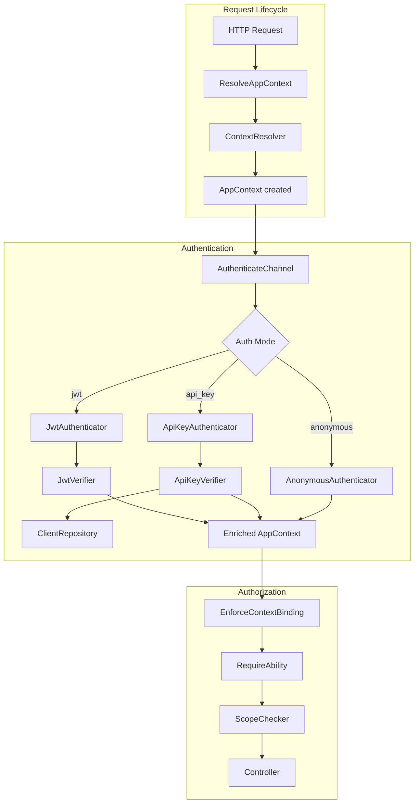

# Architecture Deep Dive

This document provides a comprehensive technical overview of Laravel App Context's internal architecture, component interactions, and design decisions.

## Table of Contents

1. [Overview](#overview)
2. [Design Principles](#design-principles)
3. [Component Architecture](#component-architecture)
4. [Service Provider](#service-provider)
5. [Context Resolution](#context-resolution)
6. [Authentication System](#authentication-system)
7. [Middleware Pipeline](#middleware-pipeline)
8. [Repository Pattern](#repository-pattern)
9. [Exception Handling](#exception-handling)
10. [Extension Points](#extension-points)

---

## Overview

Laravel App Context follows a layered architecture that separates concerns and enables extensibility:

```
┌─────────────────────────────────────────────────────────────────────┐
│                         Application Layer                            │
│  Controllers, Services, Models                                       │
├─────────────────────────────────────────────────────────────────────┤
│                         Context Layer                                │
│  AppContext (immutable value object)                                 │
├─────────────────────────────────────────────────────────────────────┤
│                         Middleware Layer                             │
│  ResolveAppContext → RateLimitByContext → AuthenticateChannel →     │
│  EnforceContextBinding → RequireAbility → InjectAuditContext        │
├─────────────────────────────────────────────────────────────────────┤
│                         Authentication Layer                         │
│  Authenticators: JWT, API Key, Anonymous                            │
│  Verifiers: JwtVerifier, ApiKeyVerifier                             │
├─────────────────────────────────────────────────────────────────────┤
│                         Storage Layer                                │
│  Repositories: Config, Eloquent, Custom                             │
├─────────────────────────────────────────────────────────────────────┤
│                         Infrastructure Layer                         │
│  Laravel Framework, JWT Library, Cache, Database                    │
└─────────────────────────────────────────────────────────────────────┘
```

---

## Design Principles

### 1. Immutability

The `AppContext` object is immutable. Once created, its state cannot be changed. Modifications return new instances:

```php
// Each modification returns a new instance
$context = AppContext::fromChannel('admin', 'jwt', '127.0.0.1');
$enriched = $context->withUserId(123)->withScopes(['admin:*']);

// Original is unchanged
assert($context->getUserId() === null);
assert($enriched->getUserId() === 123);
```

**Why immutability?**
- Thread safety in async contexts
- Predictable state throughout request lifecycle
- Easier debugging and testing
- Prevention of accidental state mutations

### 2. Single Responsibility

Each component has one clear responsibility:

| Component | Responsibility |
|-----------|----------------|
| `ContextResolver` | Detect channel from request |
| `JwtAuthenticator` | Handle JWT authentication |
| `ApiKeyVerifier` | Validate API key hashes |
| `ScopeChecker` | Match scopes with wildcards |
| `EnforceContextBinding` | Validate audience/tenant |

### 3. Dependency Inversion

Components depend on abstractions (interfaces), not concrete implementations:

```php
// Code depends on interface
public function __construct(
    private ClientRepositoryInterface $repository
) {}

// Implementation is injected via service container
$this->app->singleton(
    ClientRepositoryInterface::class,
    EloquentClientRepository::class
);
```

### 4. Fail-Safe Defaults

Security-critical settings default to the most restrictive option:

```php
'deny_by_default' => true,        // Reject unknown channels
'verify_aud' => true,             // Validate JWT audience
'verify_iss' => true,             // Validate JWT issuer
'strict_algorithm_check' => true,  // Enforce algorithm whitelist
'enforce_tenant_binding' => true,  // Validate tenant claims
```

---

## Component Architecture

### Class Diagram

```
┌─────────────────────────────────────────────────────────────────────┐
│                             Facades                                  │
│  ┌─────────────────────────────────────────────────────────────────┐│
│  │ AppContext (Facade)                                             ││
│  │ - current(): AppContext                                         ││
│  │ - isResolved(): bool                                            ││
│  │ - getChannelConfig(channel): array                              ││
│  └─────────────────────────────────────────────────────────────────┘│
└─────────────────────────────────────────────────────────────────────┘
                                    │
                                    ▼
┌─────────────────────────────────────────────────────────────────────┐
│                          Value Objects                               │
│  ┌──────────────────────────┐  ┌──────────────────────────────────┐ │
│  │ AppContext               │  │ ClientInfo                       │ │
│  │ - appId: ?string         │  │ - appCode: string                │ │
│  │ - authMode: ?string      │  │ - name: string                   │ │
│  │ - userId: int|string|null│  │ - keyHash: string                │ │
│  │ - clientId: ?string      │  │ - channel: string                │ │
│  │ - tenantId: ?string      │  │ - tenantId: ?string              │ │
│  │ - scopes: array          │  │ - capabilities: array            │ │
│  │ - capabilities: array    │  │ - ipAllowlist: array             │ │
│  │ - metadata: array        │  │ - isActive: bool                 │ │
│  │ - deviceId: ?string      │  │ - isRevoked: bool                │ │
│  │ - ipAddress: ?string     │  │ - expiresAt: ?DateTimeInterface  │ │
│  │ - requestId: ?string     │  │ - metadata: array                │ │
│  └──────────────────────────┘  └──────────────────────────────────┘ │
└─────────────────────────────────────────────────────────────────────┘
                                    │
                                    ▼
┌─────────────────────────────────────────────────────────────────────┐
│                           Contracts                                  │
│  ┌──────────────────────────┐  ┌──────────────────────────────────┐ │
│  │ ContextResolverInterface │  │ ClientRepositoryInterface        │ │
│  │ - resolve(Request)       │  │ - findByAppCode(code, prefix)    │ │
│  │   : ?AppContext          │  │ - verifyKeyHash(key, hash)       │ │
│  └──────────────────────────┘  │ - trackUsage(code, ip, ...)      │ │
│                                │ - generateKey(): array           │ │
│  ┌──────────────────────────┐  │ - create(data): ClientInfo       │ │
│  │ AuthenticatorInterface   │  │ - revoke(code): bool             │ │
│  │ - authenticate(Request,  │  │ - all(filters): iterable         │ │
│  │     AppContext)          │  └──────────────────────────────────┘ │
│  │   : AppContext           │                                       │
│  └──────────────────────────┘                                       │
└─────────────────────────────────────────────────────────────────────┘
```

### Component Interactions



---

## Service Provider

The `AppContextServiceProvider` is the central registration point for all components.

### Registration Phase (`register()`)

```php
public function register(): void
{
    // 1. Merge configuration
    $this->mergeConfigFrom(__DIR__ . '/../config/app-context.php', 'app-context');

    // 2. Configure JWT fallback for development
    $this->configureJwtFallback();

    // 3. Register core services
    $this->registerContextResolver();
    $this->registerClientRepository();
    $this->registerVerifiers();
    $this->registerAuthenticators();
    $this->registerScopeChecker();
    $this->registerAppContext();

    // 4. Register commands
    $this->commands([RoutesByChannel::class]);
}
```

### Boot Phase (`boot()`)

```php
public function boot(): void
{
    // 1. Publish configuration
    $this->publishes([
        __DIR__ . '/../config/app-context.php' => config_path('app-context.php'),
    ], 'app-context-config');

    // 2. Register middleware aliases
    $this->registerMiddlewareAliases();

    // 3. Register middleware group
    $this->registerMiddlewareGroup();

    // 4. Register custom auth guard
    $this->registerAuthGuard();
}
```

### Service Bindings

| Binding | Concrete | Lifecycle |
|---------|----------|-----------|
| `ContextResolverInterface` | `ContextResolver` | Singleton |
| `ClientRepositoryInterface` | Config/Eloquent/Custom | Singleton |
| `JwtVerifier` | `JwtVerifier` | Singleton |
| `ApiKeyVerifier` | `ApiKeyVerifier` | Singleton |
| `JwtAuthenticator` | `JwtAuthenticator` | Singleton |
| `ApiKeyAuthenticator` | `ApiKeyAuthenticator` | Singleton |
| `AnonymousAuthenticator` | `AnonymousAuthenticator` | Singleton |
| `ScopeChecker` | `ScopeChecker` | Singleton |
| `AppContext` | null (set by middleware) | Singleton |

---

## Context Resolution

### ContextResolver

The `ContextResolver` determines which channel a request belongs to based on host and path:

```php
class ContextResolver implements ContextResolverInterface
{
    public function resolve(Request $request): ?AppContext
    {
        // 1. Determine detection strategy
        $strategy = $this->getDetectionStrategy($request);

        // 2. Extract channel identifier
        $channel = match ($strategy) {
            'subdomain' => $this->resolveFromSubdomain($request),
            'path' => $this->resolveFromPath($request),
            'strict' => $this->resolveStrict($request),
            'auto' => $this->resolveAuto($request),
        };

        // 3. Validate channel exists
        if (!$channel || !$this->channelExists($channel)) {
            return null;
        }

        // 4. Create base context
        return AppContext::fromChannel(
            appId: $channel,
            authMode: $this->getAuthMode($channel),
            ipAddress: $request->ip(),
        );
    }
}
```

### Detection Strategies

**Subdomain Detection:**
```
https://mobile.myapp.com/users
        ^^^^^^
        Channel: mobile
```

**Path Detection:**
```
https://myapp.com/mobile/users
                 /^^^^^^
                 Channel: mobile
```

**Auto Detection:**
- Development hosts (localhost, *.test) → Path detection
- Production hosts → Subdomain detection

### Channel Matching Algorithm

```php
private function matchChannel(string $subdomain, string $path): ?string
{
    foreach ($this->channels as $name => $config) {
        // Check subdomain match
        if (in_array($subdomain, $config['subdomains'] ?? [])) {
            return $name;
        }

        // Check path prefix match
        foreach ($config['path_prefixes'] ?? [] as $prefix) {
            if (str_starts_with($path, $prefix)) {
                return $name;
            }
        }
    }

    return null;
}
```

---

## Authentication System

### Authenticator Selection

The `AuthenticateChannel` middleware selects the appropriate authenticator based on `auth_mode`:

```php
private function getAuthenticator(string $authMode): AuthenticatorInterface
{
    return match ($authMode) {
        'jwt', 'jwt_or_anonymous' => $this->jwtAuthenticator,
        'api_key' => $this->apiKeyAuthenticator,
        'anonymous' => $this->anonymousAuthenticator,
        default => throw new InvalidArgumentException("Unknown auth mode: {$authMode}"),
    };
}
```

### JWT Authentication Flow

```php
class JwtAuthenticator implements AuthenticatorInterface
{
    public function authenticate(Request $request, AppContext $context): AppContext
    {
        // 1. Extract token from request
        $token = $this->extractToken($request);

        if (!$token) {
            if ($context->getAuthMode() === 'jwt_or_anonymous') {
                return $this->anonymousAuthenticator->authenticate($request, $context);
            }
            throw AuthenticationException::missingToken();
        }

        // 2. Verify token
        $payload = $this->verifier->verify($token, $context);

        // 3. Load user
        $user = $this->loadUser($payload['sub']);

        // 4. Build scopes
        $scopes = $this->buildScopes($payload, $user, $context);

        // 5. Return enriched context
        return $context
            ->withUserId($user->getAuthIdentifier())
            ->withScopes($scopes)
            ->withTenantId($payload['tid'] ?? null)
            ->withDeviceId($payload['did'] ?? null)
            ->addMetadata('jwt_claims', $payload);
    }
}
```

### JWT Verification Process

```php
class JwtVerifier
{
    public function verify(string $token, AppContext $context): array
    {
        // 1. Pre-verification (structure, algorithm)
        $this->preVerify($token);

        // 2. Signature verification via JWTAuth library
        $payload = JWTAuth::setToken($token)->getPayload()->toArray();

        // 3. Post-verification (blacklist, claims)
        $this->postVerify($token, $payload, $context);

        return $payload;
    }

    private function preVerify(string $token): void
    {
        // Validate structure
        $parts = explode('.', $token);
        if (count($parts) !== 3) {
            throw AuthenticationException::invalidToken('Invalid JWT structure');
        }

        // Decode header
        $header = json_decode(base64_decode($parts[0]), true);

        // Check algorithm
        $algorithm = $header['alg'] ?? '';
        if (strtolower($algorithm) === 'none') {
            Log::warning('JWT none algorithm attack attempt', [
                'ip' => request()->ip(),
            ]);
            throw AuthenticationException::algorithmMismatch('none');
        }

        if (!in_array($algorithm, $this->allowedAlgorithms)) {
            throw AuthenticationException::algorithmMismatch($algorithm);
        }
    }

    private function postVerify(string $token, array $payload, AppContext $context): void
    {
        // Check blacklist
        if ($this->isBlacklisted($payload['jti'] ?? '')) {
            throw AuthenticationException::blacklistedToken();
        }

        // Validate audience (if enabled)
        if ($this->verifyAud && isset($payload['aud'])) {
            if ($payload['aud'] !== $context->getAppId()) {
                // Let binding middleware handle this
            }
        }
    }
}
```

### API Key Authentication Flow

```php
class ApiKeyAuthenticator implements AuthenticatorInterface
{
    public function authenticate(Request $request, AppContext $context): AppContext
    {
        // 1. Extract credentials
        $clientId = $request->header($this->clientIdHeader);
        $apiKey = $request->header($this->apiKeyHeader);

        if (!$clientId || !$apiKey) {
            throw AuthenticationException::missingApiKey();
        }

        // 2. Extract key prefix for lookup
        $keyPrefix = $this->extractKeyPrefix($apiKey);

        // 3. Verify credentials
        $clientInfo = $this->verifier->verify($clientId, $apiKey, $keyPrefix, $request->ip());

        // 4. Track usage
        $this->repository->trackUsage(
            $clientId,
            $request->ip(),
            $keyPrefix,
            $request->userAgent()
        );

        // 5. Return enriched context
        return $context
            ->withClientId($clientId)
            ->withCapabilities($clientInfo->capabilities)
            ->withTenantId($clientInfo->tenantId)
            ->addMetadata('client_info', $clientInfo->toArray());
    }
}
```

### API Key Verification Process

```php
class ApiKeyVerifier
{
    public function verify(
        string $clientId,
        string $apiKey,
        string $keyPrefix,
        string $clientIp
    ): ClientInfo {
        // 1. Find client
        $client = $this->repository->findByAppCode($clientId, $keyPrefix);

        if (!$client) {
            throw AuthenticationException::clientNotFound();
        }

        // 2. Verify hash
        if (!$this->repository->verifyKeyHash($apiKey, $client->keyHash)) {
            throw AuthenticationException::invalidApiKey('Invalid API key');
        }

        // 3. Check active status
        if (!$client->isActive) {
            throw AuthenticationException::invalidApiKey('Client is inactive');
        }

        // 4. Check revocation
        if ($client->isRevoked) {
            throw AuthenticationException::revokedApiKey();
        }

        // 5. Check expiration
        if ($client->isExpired()) {
            throw AuthenticationException::expiredApiKey();
        }

        // 6. Validate IP allowlist
        if (!empty($client->ipAllowlist)) {
            if (!$this->isIpAllowed($clientIp, $client->ipAllowlist)) {
                throw AuthenticationException::ipNotAllowed($clientIp);
            }
        }

        return $client;
    }

    private function isIpAllowed(string $ip, array $allowlist): bool
    {
        foreach ($allowlist as $allowed) {
            if (str_contains($allowed, '/')) {
                // CIDR notation
                if ($this->ipInCidr($ip, $allowed)) {
                    return true;
                }
            } else {
                // Exact match
                if ($ip === $allowed) {
                    return true;
                }
            }
        }

        return false;
    }
}
```

---

## Middleware Pipeline

### Middleware Order and Responsibilities

```
┌─────────────────────────────────────────────────────────────────────┐
│ 1. ResolveAppContext                                                │
│    - Detect channel from host/path                                  │
│    - Create base AppContext                                         │
│    - Bind to container                                              │
│    - Handle deny_by_default                                         │
├─────────────────────────────────────────────────────────────────────┤
│ 2. RateLimitByContext                                               │
│    - Get channel rate limit profile                                 │
│    - Check endpoint-specific limits                                 │
│    - Apply burst limits                                             │
│    - Add response headers                                           │
├─────────────────────────────────────────────────────────────────────┤
│ 3. AuthenticateChannel                                              │
│    - Select authenticator based on auth_mode                        │
│    - Verify credentials (JWT/API Key)                               │
│    - Enrich AppContext with identity                                │
│    - Update container binding                                       │
├─────────────────────────────────────────────────────────────────────┤
│ 4. EnforceContextBinding                                            │
│    - Validate JWT audience matches channel                          │
│    - Validate tenant ID matches request                             │
│    - Prevent cross-channel/cross-tenant access                      │
├─────────────────────────────────────────────────────────────────────┤
│ 5. RequireAbility (per-route)                                       │
│    - Check required scopes/capabilities                             │
│    - Support wildcard matching                                      │
│    - Throw AuthorizationException if missing                        │
├─────────────────────────────────────────────────────────────────────┤
│ 6. InjectAuditContext                                               │
│    - Share context with logger                                      │
│    - Log request (if enabled)                                       │
│    - Log response (if enabled)                                      │
│    - Redact sensitive headers                                       │
└─────────────────────────────────────────────────────────────────────┘
```

### Middleware Implementation Pattern

Each middleware follows this pattern:

```php
class ExampleMiddleware
{
    public function handle(Request $request, Closure $next, ...$params)
    {
        // 1. Get current context
        $context = $request->attributes->get('app_context');

        // 2. Perform middleware-specific logic
        $enrichedContext = $this->processRequest($request, $context);

        // 3. Update request attribute
        $request->attributes->set('app_context', $enrichedContext);

        // 4. Update container binding
        app()->instance(AppContext::class, $enrichedContext);

        // 5. Continue pipeline
        return $next($request);
    }
}
```

---

## Repository Pattern

### Interface Definition

```php
interface ClientRepositoryInterface
{
    /**
     * Find client by app code and optional key prefix.
     */
    public function findByAppCode(string $appCode, ?string $keyPrefix = null): ?ClientInfo;

    /**
     * Verify API key hash matches stored hash.
     */
    public function verifyKeyHash(string $key, string $storedHash): bool;

    /**
     * Track API key usage.
     */
    public function trackUsage(
        string $appCode,
        string $ip,
        ?string $keyPrefix = null,
        ?string $userAgent = null
    ): void;

    /**
     * Generate a new API key with hash and prefix.
     */
    public function generateKey(): array;

    /**
     * Create a new client.
     */
    public function create(array $data): ClientInfo;

    /**
     * Revoke a client.
     */
    public function revoke(string $appCode): bool;

    /**
     * List all clients with optional filters.
     */
    public function all(array $filters = []): iterable;
}
```

### Config Repository

Stores clients in configuration files:

```php
class ConfigClientRepository implements ClientRepositoryInterface
{
    public function findByAppCode(string $appCode, ?string $keyPrefix = null): ?ClientInfo
    {
        $clients = config('app-context.client_repository.config.clients', []);

        if (!isset($clients[$appCode])) {
            return null;
        }

        return ClientInfo::fromArray([
            'app_code' => $appCode,
            ...$clients[$appCode],
        ]);
    }

    public function verifyKeyHash(string $key, string $storedHash): bool
    {
        return Hash::check($key, $storedHash);
    }

    public function trackUsage(...): void
    {
        // No-op for config driver
    }
}
```

### Eloquent Repository

Stores clients in database with support for multiple keys per client:

```php
class EloquentClientRepository implements ClientRepositoryInterface
{
    public function findByAppCode(string $appCode, ?string $keyPrefix = null): ?ClientInfo
    {
        // Multi-table schema
        if ($this->usesMultiTableSchema()) {
            $app = DB::table($this->appsTable)
                ->where('app_code', $appCode)
                ->where('is_active', true)
                ->first();

            if (!$app) {
                return null;
            }

            $key = DB::table($this->appKeysTable)
                ->where('app_id', $app->id)
                ->where('key_prefix', $keyPrefix)
                ->whereNull('revoked_at')
                ->first();

            if (!$key) {
                return null;
            }

            return $this->buildClientInfo($app, $key);
        }

        // Legacy single-table schema
        return $this->findFromLegacyTable($appCode);
    }

    public function trackUsage(
        string $appCode,
        string $ip,
        ?string $keyPrefix = null,
        ?string $userAgent = null
    ): void {
        if ($this->asyncTracking) {
            // Dispatch job for async tracking
            dispatch(new TrackApiKeyUsage($appCode, $ip, $keyPrefix, $userAgent));
        } else {
            // Sync update
            DB::table($this->appKeysTable)
                ->where('key_prefix', $keyPrefix)
                ->update([
                    'last_used_at' => now(),
                    'last_used_ip' => $ip,
                    'last_user_agent' => $userAgent,
                ]);
        }
    }
}
```

---

## Exception Handling

### Exception Hierarchy

```
Exception
└── AppContextException (implements HttpExceptionInterface)
    ├── AuthenticationException (401)
    │   ├── invalidToken(reason)
    │   ├── missingToken()
    │   ├── invalidApiKey(reason)
    │   ├── missingApiKey()
    │   ├── expiredApiKey()
    │   ├── revokedApiKey()
    │   ├── blacklistedToken()
    │   ├── algorithmMismatch(algorithm)
    │   ├── ipNotAllowed(ip)
    │   ├── userNotFound()
    │   └── clientNotFound()
    │
    ├── AuthorizationException (403)
    │   ├── missingScope(scope)
    │   ├── missingCapability(capability)
    │   ├── missingAnyPermission(permissions)
    │   └── insufficientPermissions()
    │
    └── ContextBindingException (403)
        ├── audienceMismatch(expected, actual)
        ├── channelMismatch(expected, actual)
        ├── tenantMismatch(expected, actual)
        ├── missingTenant()
        ├── unknownChannel(channel)
        └── denyByDefault()
```

### Exception Response Format

All exceptions render as JSON:

```json
{
  "error": "AUTHENTICATION_FAILED",
  "message": "Invalid or expired token",
  "context": "jwt_verification"
}
```

### Error Codes

| Code | HTTP Status | Description |
|------|-------------|-------------|
| `AUTHENTICATION_FAILED` | 401 | Credentials invalid or missing |
| `AUTHORIZATION_FAILED` | 403 | Missing required permissions |
| `CONTEXT_BINDING_FAILED` | 403 | Audience/tenant mismatch |

---

## Extension Points

### Custom Authenticator

```php
class OAuth2Authenticator implements AuthenticatorInterface
{
    public function authenticate(Request $request, AppContext $context): AppContext
    {
        $token = $request->bearerToken();

        // Validate OAuth2 token with provider
        $tokenInfo = $this->validateWithProvider($token);

        return $context
            ->withUserId($tokenInfo->user_id)
            ->withScopes($tokenInfo->scopes)
            ->addMetadata('oauth2_client', $tokenInfo->client_id);
    }
}

// Register in service provider
$this->app->singleton('app-context.authenticator.oauth2', OAuth2Authenticator::class);
```

### Custom Repository

```php
class ApiGatewayRepository implements ClientRepositoryInterface
{
    public function findByAppCode(string $appCode, ?string $keyPrefix = null): ?ClientInfo
    {
        // Fetch from API gateway
        $response = Http::get("https://gateway/clients/{$appCode}");

        if (!$response->ok()) {
            return null;
        }

        return ClientInfo::fromArray($response->json());
    }

    // Implement other methods...
}
```

### Custom Scope Matcher

```php
class HierarchicalScopeChecker extends ScopeChecker
{
    public function hasScope(array $userScopes, string $requiredScope): bool
    {
        // Support hierarchical scopes: admin > admin:users > admin:users:read
        $parts = explode(':', $requiredScope);

        for ($i = count($parts); $i > 0; $i--) {
            $checkScope = implode(':', array_slice($parts, 0, $i));

            if (parent::hasScope($userScopes, $checkScope)) {
                return true;
            }
        }

        return false;
    }
}
```

---

## Performance Considerations

### Caching Strategies

1. **Configuration Caching**: Run `php artisan config:cache` in production
2. **Client Caching**: Implement caching in custom repositories
3. **Rate Limit Storage**: Use Redis for distributed rate limiting

### Async Operations

1. **Usage Tracking**: Enable `async_tracking` to dispatch jobs
2. **Audit Logging**: Consider queued logging for high-traffic APIs

### Database Optimization

1. **Indexes**: Ensure indexes on `app_code`, `key_prefix`, `app_id`
2. **Connection Pooling**: Use persistent connections
3. **Read Replicas**: Configure `connection` for read-heavy loads

---

## Testing Architecture

### Test Doubles

```php
// Mock repository
$repository = Mockery::mock(ClientRepositoryInterface::class);
$repository->shouldReceive('findByAppCode')
    ->with('test-client', 'abc123')
    ->andReturn(new ClientInfo([...]));

// Bind mock
$this->app->instance(ClientRepositoryInterface::class, $repository);
```

### Context Factories

```php
// Create test context
$context = AppContext::fromChannel('admin', 'jwt', '127.0.0.1')
    ->withUserId(1)
    ->withScopes(['admin:*'])
    ->withTenantId('test-tenant');

// Bind for tests
$this->app->instance(AppContext::class, $context);
```

---

This architecture enables Laravel App Context to handle complex multi-channel authentication scenarios while remaining extensible and maintainable.
