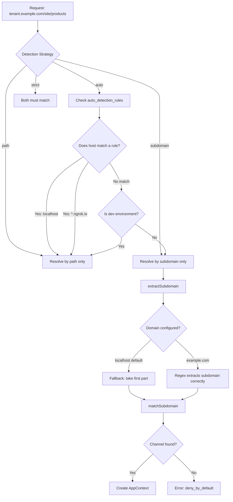

# Repo Findings Summary

- Package name: `ronu/laravel-app-context` with Laravel 11/12 support and JWT via `php-open-source-saver/jwt-auth`. The service provider is `Ronu\AppContext\AppContextServiceProvider`. 
- Middleware provided: `app.context`, `app.auth`, `app.binding`, `app.scope`, `app.requires`, `app.throttle`, `app.audit`, plus `app-context` group. 
- Configuration lives in `config/app-context.php` (channels, client repository, JWT, API keys, rate limiting, security, audit, public routes). 
- Storage: config-based clients or database-backed repositories (legacy `api_clients` or recommended `api_apps` + `api_app_keys`). 
- JWT verification includes strict algorithm checks and audience/issuer validation; API key verification uses headers `X-Client-Id` and `X-Api-Key` by default.

# Documentation

## 1) Title + One-paragraph Overview

**Laravel App Context – Multi-Channel Context + JWT/API Key Security**

This package provides deterministic application context resolution (channel + tenant + auth mode), standardized middleware ordering, JWT/API key authentication integration, and context-aware rate limiting/logging for Laravel 11/12 applications. It resolves context from host/path only (never from unsigned headers), binds tokens to channel and tenant, and exposes a single `AppContext` object for authorization decisions. All registration is done via `Ronu\AppContext\AppContextServiceProvider`, with configuration in `config/app-context.php`.

## 2) Quick Start (5–10 steps)

1) Install the package with Composer (see Installation).  
2) Publish the config: `php artisan vendor:publish --tag=app-context-config`.  
3) Configure `config/app-context.php` channels (e.g., `mobile`, `admin`, `partner`) and select `auth_mode` per channel.  
4) Choose a client repository driver (`config` or `eloquent`).  
5) If using `eloquent`, add tables for `api_apps` + `api_app_keys` (or legacy `api_clients`).  
6) Add middleware to route groups in the correct order (see Middleware Reference + Channel Setup Examples).  
7) Ensure login routes only run `app.context` + rate limiting, then issue JWT with `aud` matching the channel.  
8) Ensure `app.binding` runs after JWT to enforce audience/tenant binding.  
9) Validate API key headers (`X-Client-Id`, `X-Api-Key`) for B2B routes.  
10) Verify rate limit profiles and audit logging settings in `config/app-context.php`.

## 3) Installation

### Composer

```bash
composer require ronu/laravel-app-context
```

### Publish configuration

```bash
php artisan vendor:publish --tag=app-context-config
```

### Service Provider Auto-Discovery

Laravel auto-discovers the service provider via `composer.json`. If auto-discovery is disabled, register it in your app’s provider list:

```php
// config/app.php
'providers' => [
    Ronu\AppContext\AppContextServiceProvider::class,
],
```

## 4) Package Architecture (include a Mermaid diagram of request flow)

**Request Flow Overview**

```mermaid
flowchart TD
    A[Incoming Request] --> B[ResolveAppContext (host/path)]
    B --> H[RateLimitByContext]
    H --> C{Auth Mode}
    C -->|jwt| D[AuthenticateChannel: JWT]
    C -->|api_key| E[AuthenticateChannel: API Key]
    C -->|anonymous| F[AuthenticateChannel: Anonymous]
    D --> G[EnforceContextBinding]
    E --> G[EnforceContextBinding]
    F --> G[EnforceContextBinding]
    G --> J[RequireAbility (per-route)]
    J --> I[InjectAuditContext]
    I --> K[Controller / App Logic]
```

## 5) Middleware Reference

> All middleware aliases and the `app-context` group are registered in `Ronu\AppContext\AppContextServiceProvider` via `Router::aliasMiddleware()` and `middlewareGroup()`.

| Middleware | Purpose | Where to register | Order | Applies to |
|---|---|---|---|---|
| `app.context` | Resolve channel + base context from host/path | Route group (or `app-context` group) | 1 | dashboard, mobile, b2b |
| `app.throttle` | Context-aware rate limiting | Route group | 2 | dashboard, mobile, b2b |
| `app.auth` | Authenticate per channel (`jwt`, `api_key`, `anonymous`) | Route group | 3 | dashboard, mobile, b2b |
| `app.binding` | Enforce audience/tenant binding | Route group | 4 | dashboard, mobile, b2b |
| `app.audit` | Inject context into logs | Route group | 5 | dashboard, mobile, b2b |
| `app.requires` | Enforce scopes/capabilities (OR) | Per-route | After auth/binding | dashboard, mobile, b2b |
| `app.requires.all` | Enforce scopes/capabilities (AND) | Per-route | After auth/binding | dashboard, mobile, b2b |
| `app.scope` | Enforce scopes/capabilities (legacy) | Per-route | After auth/binding | dashboard, mobile, b2b |

**Note:** There is an additional middleware class `Ronu\AppContext\Middleware\RequireAllScopes`, but it is not aliased by the service provider. If you want to use it, register an alias in your app (see below).

### Optional: Register `RequireAllScopes` alias (if you want AND logic)

**Laravel 11/12 (`bootstrap/app.php`)**

```php
// bootstrap/app.php
->withMiddleware(function (Illuminate\Foundation\Configuration\Middleware $middleware) {
    $middleware->alias([
        'app.scope.all' => Ronu\AppContext\Middleware\RequireAllScopes::class,
    ]);
})
```

**Legacy (`app/Http/Kernel.php`)**

```php
// app/Http/Kernel.php
protected $routeMiddleware = [
    'app.scope.all' => Ronu\AppContext\Middleware\RequireAllScopes::class,
];
```

**Avoid double rate limiting:** if you enable `app.throttle` (`RateLimitByContext`) in your API group, remove Laravel's default `throttle:api` middleware (or set it to a very high limit) to prevent double throttling.

## 6) Configuration

Configuration file: `config/app-context.php`.

### Core Keys

| Key | Description | Default / Example |
|---|---|---|
| `client_repository.driver` | Storage backend (`config`, `eloquent`, or custom class) | `config` |
| `deny_by_default` | Reject requests with no channel match | `true` |
| `default_channel` | Channel used when deny-by-default is off | `default` |
| `domain` | Base domain for subdomain parsing | `APP_CONTEXT_DOMAIN` |
| `detection_strategy` | `auto`, `path`, `subdomain`, `strict` | `auto` |
| `auto_detection_rules` | Host → strategy mapping | see file |
| `app_context_dev` | Envs that default to path detection | `local` |
| `channels` | Channel definitions (auth mode, scopes, capabilities) | see file |
| `rate_limits` | Channel rate limit profiles | see file |
| `jwt` | JWT verification + fallback settings | see file |
| `api_key` | API key headers, rotation, format | see file |
| `security` | Enforcement toggles | see file |
| `audit` | Logging configuration | see file |
| `public_routes` | Paths/names that skip auth | see file |

### Channel Definitions (critical for security)

Each channel in `config/app-context.php` defines:
- **`auth_mode`**: `jwt`, `api_key`, `anonymous`, or `jwt_or_anonymous`.  
- **`jwt_audience`**: expected `aud` for JWT channels.  
- **`allowed_scopes`** / **`allowed_capabilities`**: allow-list for JWT/API key permissions.  
- **`public_scopes`**: public scopes for anonymous or `jwt_or_anonymous` fallback.  
- **`anonymous_on_invalid_token`**: allow optional fallback to anonymous when JWT is invalid (default false).  
- **`tenant_mode`**: `single` or `multi`.  
- **`audit`**: per-channel audit overrides (`enabled`, `log_all_requests`, etc.).  

### API Key Headers

Default headers (configurable in `api_key.headers`):
- `X-Client-Id` → client identifier (`app_code`)  
- `X-Api-Key` → API key (format: `prefix.secret`)  

### JWT Configuration for Reverse Proxy

When your application is behind a reverse proxy (nginx, HAProxy, etc.) that terminates SSL, the protocol may change from `https` to `http` internally. This causes issuer validation to fail because the URLs don't match exactly.

| Environment Variable | Description | Default |
|---|---|---|
| `JWT_IGNORE_ISSUER_SCHEME` | Ignore protocol (http/https) when validating issuer | `false` |

**Usage example:**

```env
# .env
JWT_ISSUER=https://api.example.com
JWT_IGNORE_ISSUER_SCHEME=true
```

With this configuration, the following URLs will be considered equivalent:
- `https://api.example.com/admin/login`
- `http://api.example.com/admin/login`

### Secure Defaults

Recommended production defaults already reflected in the config:
- `deny_by_default = true`
- `security.strict_algorithm_check = true`
- `jwt.verify_aud = true` and `jwt.verify_iss = true`
- `api_key.hash_algorithm = argon2id`
- `security.enforce_tenant_binding = true`  

## 7) Authentication (JWT with php-open-source-saver/jwt-auth)

### Controller changes (login/logout/refresh)

> The package **does not** ship an AuthController. If your app already has `AuthController@login`, `logout`, and `refresh`, keep them and add app-context binding and claims as shown below.

**Where to put:** Your application’s `app/Http/Controllers/AuthController.php`.

#### Login (JWT: bind app context into claims)

```php
use Illuminate\Http\Request;
use Illuminate\Support\Facades\Auth;
use PHPOpenSourceSaver\JWTAuth\Facades\JWTAuth;
use Ronu\AppContext\Context\AppContext;

public function login(Request $request, AppContext $context)
{
    $credentials = $request->only(['email', 'password']);

    if (! $token = Auth::attempt($credentials)) {
        return response()->json(['message' => 'Invalid credentials'], 401);
    }

    // Bind app context to JWT claims
    $claims = [
        'aud' => $context->getAppId(),
        'tid' => $request->header('X-Tenant-Id') ?? $request->route('tenant_id') ?? $request->query('tenant_id'),
        'scp' => [],
    ];

    $token = JWTAuth::claims($claims)->fromUser(Auth::user());

    return response()->json([
        'access_token' => $token,
        'token_type' => 'Bearer',
        'expires_in' => config('app-context.jwt.ttl'),
        'audience' => $context->getAppId(),
        'tenant_id' => $claims['tid'],
    ]);
}
```

#### Logout (invalidate current token)

```php
use PHPOpenSourceSaver\JWTAuth\Facades\JWTAuth;

public function logout()
{
    JWTAuth::invalidate(JWTAuth::getToken());

    return response()->json(['message' => 'Logged out']);
}
```

#### Refresh (refresh token, preserve claims)

```php
use PHPOpenSourceSaver\JWTAuth\Facades\JWTAuth;

public function refresh()
{
    $newToken = JWTAuth::refresh(JWTAuth::getToken());

    return response()->json([
        'access_token' => $newToken,
        'token_type' => 'Bearer',
        'expires_in' => config('app-context.jwt.ttl'),
    ]);
}
```

### Route examples

**Login route group** (no `app.auth`):

```php
// routes/api.php
Route::middleware([
    'app.context',
    'app.binding',
    'app.throttle',
    'app.audit',
])->post('/api/login', [AuthController::class, 'login']);
```

**Authenticated route group**:

```php
Route::middleware([
    'app.context',
    'app.auth',
    'app.binding',
    'app.throttle',
    'app.audit',
])->group(function () {
    Route::get('/api/me', [AuthController::class, 'me']);
});
```

### Token claims binding to app_context (recommended)

Use at least these claims in JWTs:
- `aud`: channel id (e.g., `admin`, `mobile`, `site`)  
- `tid`: tenant id (if multi-tenant)  
- `scp`: scopes list (if your app manages scopes)  

`app.binding` enforces `aud` (if enabled) and compares tenant ID (`tid`) with request tenant data.

## 8) Channel Setup Examples

### dashboard (web client / SPA)

**Expected channel**: `admin` (JWT)

```php
// routes/api.php
Route::prefix('api')->middleware([
    'app.context',
    'app.auth',
    'app.binding',
    'app.throttle',
    'app.audit',
])->group(function () {
    Route::get('/dashboard', [DashboardController::class, 'index'])
        ->middleware('app.requires:admin:dashboard:read');
});
```

### mobile

**Expected channel**: `mobile` (JWT)

```php
// routes/api.php
Route::prefix('mobile')->middleware([
    'app.context',
    'app.auth',
    'app.binding',
    'app.throttle',
    'app.audit',
])->group(function () {
    Route::get('/orders', [OrderController::class, 'index'])
        ->middleware('app.requires:mobile:orders:read');
});
```

### b2b APIs

**Expected channel**: `partner` (API key)

```php
// routes/api.php
Route::prefix('partner')->middleware([
    'app.context',
    'app.auth',
    'app.binding',
    'app.throttle',
    'app.audit',
])->group(function () {
    Route::get('/inventory', [PartnerInventoryController::class, 'index'])
        ->middleware('app.requires:partner:inventory:read');
});
```

## 9) Domain Configuration and Channel Resolution

This section explains in detail how the system detects and resolves channels based on the host and path of the request. It is **critical** for understanding why a request may fail with the error "Request does not match any configured channel".

### 9.1) The Channel Resolution Flow



### 9.2) Base Domain Configuration

**This is the most important configuration for production.**

```php
// config/app-context.php line 102
'domain' => env('APP_CONTEXT_DOMAIN', env('APP_DOMAIN', 'localhost')),
```

#### Why is it critical to configure?

The `extractSubdomain()` method uses this value to extract the subdomain from the host:

```php
// src/Context/ContextResolver.php lines 162-166
$domain = preg_quote($this->domain, '/');
if (preg_match('/^([^.]+)\.' . $domain . '$/', $host, $matches)) {
    return $matches[1];  // The extracted subdomain
}
```

**Example with INCORRECTLY configured domain (localhost default):**

| Host | Config Domain | Generated Regex | Result |
|------|---------------|-----------------|--------|
| `tenant.example.com` | `localhost` | `/^([^.]+)\.localhost$/` | ❌ NO MATCH |
| `admin.localhost` | `localhost` | `/^([^.]+)\.localhost$/` | ✅ `admin` |

**Example with CORRECTLY configured domain:**

| Host | Config Domain | Generated Regex | Result |
|------|---------------|-----------------|--------|
| `tenant.example.com` | `example.com` | `/^([^.]+)\.example\.com$/` | ✅ `tenant` |
| `www.example.com` | `example.com` | `/^([^.]+)\.example\.com$/` | ✅ `www` |

#### Configure in .env

```env
# REQUIRED for production
APP_CONTEXT_DOMAIN=example.com

# Or alternatively
APP_DOMAIN=example.com
```

### 9.3) Detection Strategies

| Strategy | Description | When to use |
|----------|-------------|-------------|
| `auto` | Smart: uses rules to decide | **Recommended** - Handles dev and prod |
| `path` | Uses path prefixes only (`/api/*`, `/mobile/*`) | Local development, ngrok |
| `subdomain` | Uses subdomains only (`admin.`, `mobile.`) | Production with subdomains |
| `strict` | Subdomain AND path must match | Maximum security |

#### Auto-Detection Rules

```php
'auto_detection_rules' => [
    'localhost' => 'path',              // http://localhost/api → path
    '127.0.0.1' => 'path',              // http://127.0.0.1/mobile → path
    '*.localhost' => 'subdomain',       // http://api.localhost → subdomain
    '*.ngrok.io' => 'path',             // https://abc.ngrok.io/api → path
    '*.ngrok-free.app' => 'path',       // https://abc.ngrok-free.app → path
    '*.test' => 'path',                 // http://myapp.test/api → path
    '*.local' => 'path',                // http://myapp.local/api → path
    // All other hosts → 'subdomain' (production)
],
```

#### Add rule for your custom domain

```php
'auto_detection_rules' => [
    // ... existing rules ...

    // Add your production domain
    '*.example.com' => 'subdomain',     // Use subdomains
    // Or if you prefer path:
    // '*.example.com' => 'path',       // Use path prefixes
],
```

### 9.4) Channel Definition with Subdomains

```php
'channels' => [
    'site' => [
        // IMPORTANT: List all subdomains that should resolve to this channel
        'subdomains' => [
            'www',      // www.example.com
            'tenant',   // tenant.example.com
            'api',      // api.example.com
            null,       // example.com (root domain without subdomain)
        ],
        'path_prefixes' => ['/site', '/shop'],
        'auth_mode' => 'jwt_or_anonymous',
        'jwt_audience' => 'site',
        // ... rest of configuration
    ],

    'admin' => [
        'subdomains' => ['admin', 'dashboard'],
        'path_prefixes' => ['/api'],
        // ...
    ],
],
```

### 9.5) Common Scenarios and Solutions

#### Scenario 1: Custom subdomain doesn't work

**Problem:** `https://mystore.example.com/site/products` → Error "Request does not match any configured channel"

**Diagnosis:**
1. Is `APP_CONTEXT_DOMAIN=example.com` configured? ❌
2. Does the channel have `'mystore'` in `subdomains`? ❌

**Solution:**
```env
# .env
APP_CONTEXT_DOMAIN=example.com
```

```php
// config/app-context.php
'site' => [
    'subdomains' => ['www', 'mystore', null],
    // ...
]
```

#### Scenario 2: Multiple tenants with dynamic subdomains

**Problem:** Each tenant has their subdomain: `tenant1.example.com`, `tenant2.example.com`, etc.

**Solution:** Use `path` detection instead of `subdomain`:

```php
// config/app-context.php
'auto_detection_rules' => [
    // Force path detection for your domain
    '*.example.com' => 'path',
],

'channels' => [
    'site' => [
        'subdomains' => [],  // Doesn't matter
        'path_prefixes' => ['/site', '/shop', '/'],  // Detect by path
        // ...
    ],
],
```

#### Scenario 3: Local development vs Production

**Problem:** Locally I use `localhost/api` but in production `admin.example.com`

**Solution:** The `auto` strategy already handles this:

```env
# .env.local (development)
APP_ENV=local
APP_CONTEXT_DOMAIN=localhost
# Will use path detection automatically

# .env.production (production)
APP_ENV=production
APP_CONTEXT_DOMAIN=example.com
# Will use subdomain detection automatically
```

#### Scenario 4: Ngrok or development tunnel

**Problem:** `https://abc123.ngrok-free.app/site/products` doesn't work

**Solution:** Ngrok is already configured in `auto_detection_rules` to use `path`:

```php
'auto_detection_rules' => [
    '*.ngrok-free.app' => 'path',  // Already configured
],
```

Just make sure your channel has the correct path prefix:
```php
'site' => [
    'path_prefixes' => ['/site'],  // This will work with ngrok
],
```

#### Scenario 5: Same code deployed to multiple domains - one works and another doesn't

**Problem:** You have the same code deployed to two different domains. One works perfectly and the other gives "Authentication required" or "Request does not match any configured channel" error.

**Real example:**
- ✅ `https://api.example.com/site/catalog/products` → **Works**
- ❌ `https://tenant.otherdomain.org/site/catalog/products` → **Error: "Authentication required"**

**Why does this happen?**

The different behavior occurs because **each domain may have a different detection strategy** according to `auto_detection_rules`.

```
┌─────────────────────────────────────────────────────────────────────────────┐
│                    SAME CODE, DIFFERENT RESULTS                              │
├─────────────────────────────────────────────────────────────────────────────┤
│                                                                              │
│  api.example.com/site/products            tenant.otherdomain.org/site/products│
│           │                                          │                       │
│           ▼                                          ▼                       │
│  Is there a rule for *.example.com?       Is there a rule for *.otherdomain.org?│
│           │                                          │                       │
│      YES: 'path'                               NO (uses default)            │
│           │                                          │                       │
│           ▼                                          ▼                       │
│  Detects by PATH: /site                   Detects by SUBDOMAIN: tenant      │
│           │                                          │                       │
│           ▼                                          ▼                       │
│  Channel: 'site' ✅                        Channel with 'tenant'?            │
│  allow_anonymous: true                              │                        │
│           │                                    NOT found                     │
│           ▼                                          │                       │
│      WORKS ✅                                        ▼                       │
│                                              Channel: null or incorrect     │
│                                              allow_anonymous: false          │
│                                                      │                       │
│                                                      ▼                       │
│                                          ERROR: Authentication required ❌   │
│                                                                              │
└─────────────────────────────────────────────────────────────────────────────┘
```

**Step-by-step diagnosis:**

1. **Check the auto-detection rules** in your `config/app-context.php`:
   ```php
   'auto_detection_rules' => [
       '*.example.com' => 'path',      // ✅ Has rule → uses path
       // *.otherdomain.org has NO rule → uses subdomain by default
   ],
   ```

2. **When there's no rule**, the system uses `subdomain` by default in production
3. **With `subdomain` strategy**, it searches for channel by subdomain (`tenant`)
4. **If the subdomain isn't in any channel**, it fails or resolves to wrong channel

**Solution 1: Add rule for the failing domain**

```php
// config/app-context.php
'auto_detection_rules' => [
    'localhost' => 'path',
    '127.0.0.1' => 'path',
    '*.localhost' => 'subdomain',
    '*.ngrok.io' => 'path',
    '*.ngrok-free.app' => 'path',
    '*.test' => 'path',
    '*.local' => 'path',

    // ✅ ADD RULES FOR YOUR PRODUCTION DOMAINS
    '*.example.com' => 'path',        // Already working
    '*.otherdomain.org' => 'path',    // ← ADD THIS LINE
],
```

**Solution 2: Use global `path` strategy**

If all your domains should use path detection:

```env
# .env
APP_CONTEXT_DETECTION=path
```

**Solution 3: Add all possible subdomains to the channel**

If you prefer to keep the `subdomain` strategy:

```php
// config/app-context.php
'channels' => [
    'site' => [
        'subdomains' => [
            'www',
            'api',        // For api.example.com
            'tenant',     // For tenant.otherdomain.org
            'store',      // Other subdomains you use
            null,         // Root domain
        ],
        'path_prefixes' => ['/site', '/shop'],
        'auth_mode' => 'jwt_or_anonymous',
        'features' => [
            'allow_anonymous' => true,  // ✅ CRITICAL for access without JWT
        ],
    ],
],
```

**Quick reference table:**

| Configuration | api.example.com/site | tenant.otherdomain.org/site |
|---------------|----------------------|------------------------------|
| No rules | subdomain → looks for 'api' | subdomain → looks for 'tenant' |
| `*.example.com => 'path'` | path → looks for '/site' ✅ | subdomain → looks for 'tenant' ❌ |
| Both with 'path' rule | path → '/site' ✅ | path → '/site' ✅ |
| `APP_CONTEXT_DETECTION=path` | path → '/site' ✅ | path → '/site' ✅ |

**Recommendation for multi-domain:**

If you deploy the same code to multiple domains with dynamic subdomains (multi-tenant), **always use `path` detection**:

```php
// config/app-context.php
'auto_detection_rules' => [
    // Development
    'localhost' => 'path',
    '127.0.0.1' => 'path',
    '*.test' => 'path',
    '*.local' => 'path',
    '*.ngrok-free.app' => 'path',

    // Production - ALL your domains
    '*.example.com' => 'path',
    '*.otherdomain.org' => 'path',
    '*.youranotherdomain.com' => 'path',
],
```

This ensures the channel is determined by the **URL path** (`/site`, `/api`, `/mobile`) and not by the subdomain, allowing any subdomain to work correctly.

### 9.6) Debugging Channel Resolution

To diagnose issues, you can create a test endpoint:

```php
// routes/web.php (only for debugging)
Route::get('/debug-context', function (\Illuminate\Http\Request $request) {
    $resolver = app(\Ronu\AppContext\Contracts\ContextResolverInterface::class);

    $host = $request->getHost();
    $path = '/' . ltrim($request->path(), '/');

    return response()->json([
        'host' => $host,
        'path' => $path,
        'configured_domain' => config('app-context.domain'),
        'detection_strategy' => config('app-context.detection_strategy'),
        'extracted_subdomain' => $resolver->extractSubdomain($host),
        'matched_path_channel' => $resolver->matchPathPrefix($path),
        'effective_strategy' => $resolver->getDetectionStrategy($host),
        'channels_configured' => array_keys(config('app-context.channels')),
    ]);
});
```

**Example response:**
```json
{
    "host": "tenant.example.com",
    "path": "/site/catalog/products",
    "configured_domain": "localhost",
    "detection_strategy": "auto",
    "extracted_subdomain": "tenant",
    "matched_path_channel": "site",
    "effective_strategy": "subdomain",
    "channels_configured": ["mobile", "admin", "site", "partner"]
}
```

### 9.7) Domain Configuration Checklist

- [ ] `APP_CONTEXT_DOMAIN` configured in `.env` with your production domain
- [ ] All subdomains listed in the corresponding channel
- [ ] `null` included in `subdomains` if you want to support the root domain
- [ ] Rule in `auto_detection_rules` if you need special behavior
- [ ] `php artisan config:clear` executed after changes

## 10) Troubleshooting

- **"AppContext not resolved"** → Ensure `app.context` is first in the middleware chain.
- **"Request does not match any configured channel"** → Verify:
  1. `APP_CONTEXT_DOMAIN` is configured correctly
  2. The subdomain is listed in the channel's `subdomains` array
  3. The path prefix matches if using path detection
  4. Run `php artisan config:clear` after changes
- **JWT audience mismatch** → Ensure login issues tokens with `aud` matching channel (`admin`, `mobile`, etc.).
- **JWT issuer mismatch with reverse proxy** → If you're using a reverse proxy that changes the protocol (e.g., nginx with SSL termination), the token issuer (`https://`) may not match the internal URL (`http://`). Solution: set `JWT_IGNORE_ISSUER_SCHEME=true` in your `.env`.
- **Tenant mismatch errors** → Confirm tenant id is provided in route param `tenant_id`/`tenantId`, header `X-Tenant-Id`, or query `tenant_id`.
- **API key not accepted** → Verify `X-Client-Id` + `X-Api-Key` headers and ensure the key hash matches.  

## 11) Security Checklist

- [ ] `deny_by_default = true` in production.  
- [ ] `jwt.verify_aud = true` and `jwt.verify_iss = true`.  
- [ ] Tokens include `aud` (channel) and `tid` (tenant).  
- [ ] API keys stored with Argon2id/Bcrypt hashes (never plaintext).  
- [ ] IP allowlists enforced for high-risk partners (`security.enforce_ip_allowlist`).  
- [ ] Audit logging enabled for authentication failures.  
- [ ] Rate limits configured per channel and endpoint.  

## 12) Changelog Notes (breaking changes / upgrade tips)

N/A (no changelog files found in the repository).
