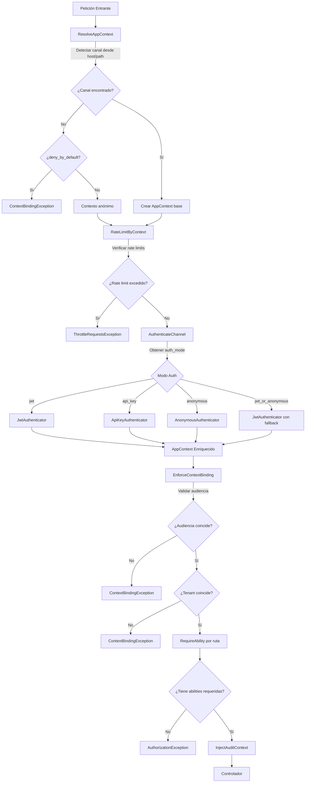
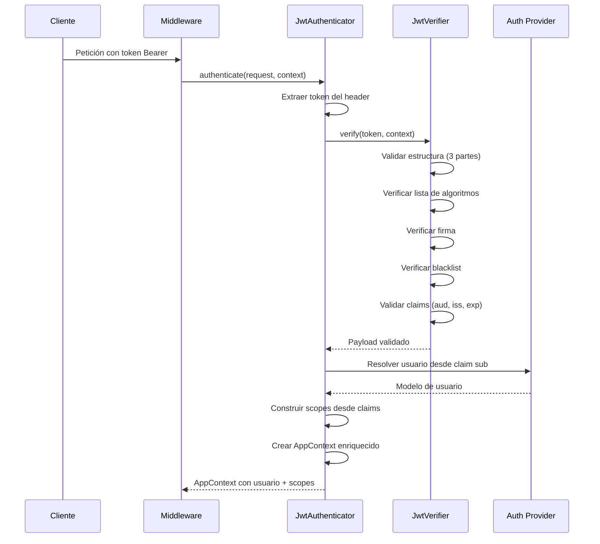
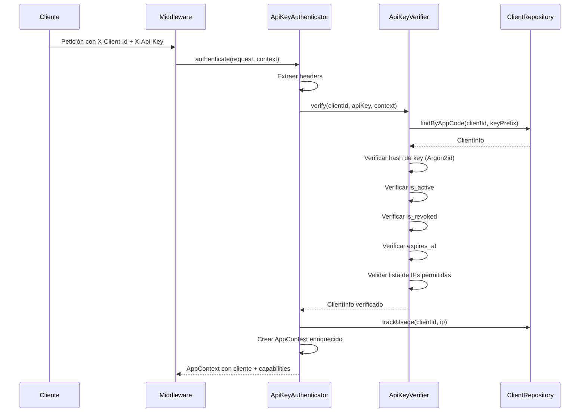

# Laravel App Context

[](https://packagist.org/packages/ronu/laravel-app-context)
[](https://packagist.org/packages/ronu/laravel-app-context)
[](https://packagist.org/packages/ronu/laravel-app-context)

**Gestión multi-canal de contexto de aplicación para Laravel con autenticación JWT y API Key.**

> **Documentación:** [English](README.md) | [Arquitectura](ARCHITECTURE.md) | [Seguridad](SECURITY.md) | [Migración](MIGRATION.md) | [Ejemplos](EXAMPLES.md)

---

## Tabla de Contenidos

1. [Introducción](#introducción)
2. [¿Por qué Laravel App Context?](#por-qué-laravel-app-context)
3. [Características Principales](#características-principales)
4. [Requisitos](#requisitos)
5. [Instalación](#instalación)
6. [Inicio Rápido (10 minutos)](#inicio-rápido-10-minutos)
7. [Conceptos Fundamentales](#conceptos-fundamentales)
8. [Arquitectura](#arquitectura)
9. [Referencia de Configuración](#referencia-de-configuración)
10. [Pipeline de Middleware](#pipeline-de-middleware)
11. [Flujos de Autenticación](#flujos-de-autenticación)
12. [Repositorio de Clientes](#repositorio-de-clientes)
13. [Rate Limiting](#rate-limiting)
14. [Características de Seguridad](#características-de-seguridad)
15. [Comandos Artisan](#comandos-artisan)
16. [Testing](#testing)
17. [Solución de Problemas](#solución-de-problemas)
18. [Preguntas Frecuentes](#preguntas-frecuentes)
19. [Glosario](#glosario)
20. [Licencia](#licencia)

---

## Introducción

**Laravel App Context** es una biblioteca completa de autenticación y autorización multi-canal para aplicaciones Laravel 11/12. Proporciona un enfoque unificado para gestionar diferentes contextos de aplicación (apps móviles, dashboards de administración, APIs de partners, sitios web públicos) con modos de autenticación, scopes y políticas de seguridad distintas.

La biblioteca introduce el concepto de **AppContext** - un objeto de valor inmutable que encapsula todo el estado de autenticación y autorización de una petición, incluyendo el canal, identidad del usuario, tenant, scopes, capabilities y metadatos. Este contexto fluye a través de toda tu aplicación, permitiendo decisiones de autorización consistentes y logging de auditoría.

A diferencia de la autenticación nativa de Laravel que trata todas las peticiones API de manera uniforme, Laravel App Context reconoce que las aplicaciones modernas sirven múltiples clientes con diferentes requisitos de seguridad. Una app móvil puede necesitar autenticación JWT con binding de dispositivo, mientras que una integración B2B con partners requiere API keys con listas de IPs permitidas.

---

## ¿Por qué Laravel App Context?

### El Problema

Las aplicaciones modernas típicamente sirven múltiples clientes:
- **Apps móviles** que requieren JWT con refresh tokens y fingerprinting de dispositivo
- **Dashboards de administración** que necesitan binding estricto de audiencia y trails de auditoría
- **APIs de partners** usando API keys con restricciones de IP y acceso basado en capabilities
- **Sitios web públicos** con autenticación opcional y acceso anónimo

La autenticación nativa de Laravel maneja bien escenarios de contexto único, pero se vuelve compleja cuando necesitas:
- Diferentes modos de autenticación por grupo de rutas
- Rate limiting específico por canal
- Aislamiento multi-tenant con binding de tokens
- Logging de auditoría unificado a través de todos los tipos de autenticación
- Protección contra reutilización de tokens entre canales

### La Solución

Laravel App Context proporciona:

| Desafío | Solución |
|---------|----------|
| Múltiples modos de auth | Autenticación basada en canal (JWT, API Key, Anonymous) |
| Ataques de reutilización de tokens | Binding de audiencia valida el canal objetivo del token |
| Aislamiento multi-tenant | Binding de tenant en claims JWT con enforcement |
| Rate limiting complejo | Rate limiting por contexto por canal/endpoint |
| Complejidad de auditoría | Inyección automática de contexto en todos los logs |
| Gestión de permisos | Scopes (JWT) y capabilities (API Key) unificados |

### Cuándo Usar (y Cuándo No)

**Usa Laravel App Context cuando:**
- Tu API sirve múltiples tipos de cliente (móvil, web, partners)
- Necesitas diferentes modos de autenticación por tipo de cliente
- Se requiere aislamiento multi-tenant
- Las integraciones B2B necesitan gestión de API keys
- Quieres logging de auditoría unificado a través de todos los tipos de auth

**Considera alternativas cuando:**
- Un solo modo de autenticación es suficiente
- No hay requisitos multi-tenant
- API simple sin separación de canales
- Laravel Sanctum/Passport cumple todas tus necesidades

---

## Características Principales

### Autenticación
- **Soporte Multi-Auth**: Autenticación JWT, API Key y Anónima
- **Enrutamiento por Canal**: Detección automática de canales por subdominio o path
- **Modo JWT Opcional**: `jwt_or_anonymous` para rutas públicas con auth opcional

### Autorización
- **Sistema de Scopes**: Scopes JWT con soporte de comodines (`admin:*`)
- **Sistema de Capabilities**: Capabilities de API Key para partners B2B
- **Abilities Unificadas**: Verifica scopes O capabilities con una sola API

### Seguridad
- **Prevención de Confusión de Algoritmo**: Rechaza el algoritmo `none` (CVE-2015-9235)
- **Binding de Audiencia**: Tokens bloqueados a su canal objetivo
- **Binding de Tenant**: Previene acceso cross-tenant
- **Listas de IPs Permitidas**: Soporte de notación CIDR para API keys
- **Blacklist de Tokens**: Invalidación de JWT respaldada por Redis

### Operaciones
- **Rate Limiting por Contexto**: Límites por canal y por endpoint
- **Logging de Auditoría**: Inyección automática de contexto en todos los logs
- **Tracking de Uso**: Estadísticas de uso de API key (async opcional)

### Flexibilidad
- **Patrón Repository**: Almacenamiento de clientes por Config, Eloquent o personalizado
- **Composición de Middleware**: Middleware granular para pipelines personalizados
- **Extensible**: Authenticators y verifiers personalizados

---

## Requisitos

- **PHP**: 8.2+
- **Laravel**: 11.0+ o 12.0+
- **Biblioteca JWT**: `php-open-source-saver/jwt-auth` 2.0+
- **Opcional**: Redis para blacklist de tokens y rate limiting

---

## Instalación

### Paso 1: Instalar vía Composer

```bash
composer require ronu/laravel-app-context
```

### Paso 2: Publicar Configuración

```bash
php artisan vendor:publish --tag=app-context-config
```

Esto crea `config/app-context.php` con todas las opciones de configuración.

### Paso 3: Configurar JWT (si usas autenticación JWT)

Si no está configurado, configura la autenticación JWT:

```bash
# Generar secreto JWT (para HS256)
php artisan jwt:secret

# O generar claves RSA (recomendado para producción)
mkdir -p storage/jwt
openssl genrsa -out storage/jwt/private.pem 4096
openssl rsa -in storage/jwt/private.pem -pubout -out storage/jwt/public.pem
```

### Paso 4: Configurar Variables de Entorno

```env
# Core
APP_CONTEXT_DOMAIN=miapp.com
APP_CONTEXT_DENY_BY_DEFAULT=true

# JWT
JWT_ALGO=RS256
JWT_PUBLIC_KEY_PATH=storage/jwt/public.pem
JWT_PRIVATE_KEY_PATH=storage/jwt/private.pem
JWT_ISSUER=https://miapp.com
JWT_TTL=3600

# API Key (si se usa)
API_KEY_HASH_ALGO=argon2id
```

### Paso 5: Configuración de Base de Datos (si usas driver Eloquent)

Si gestionas clientes API via base de datos, crea las migraciones:

```bash
php artisan make:migration create_api_apps_table
php artisan make:migration create_api_app_keys_table
```

Ver sección [Repositorio de Clientes](#repositorio-de-clientes) para ejemplos de migración.

---

## Inicio Rápido (10 minutos)

Esta guía te lleva de cero a una API protegida funcionando en 10 minutos.

### 1. Configurar un Canal

Edita `config/app-context.php`:

```php
'channels' => [
    'mobile' => [
        'subdomains' => ['mobile', 'm'],
        'path_prefixes' => ['/mobile'],
        'auth_mode' => 'jwt',
        'jwt_audience' => 'mobile',
        'allowed_scopes' => ['mobile:*', 'user:profile:*'],
        'rate_limit_profile' => 'mobile',
    ],
],
```

### 2. Crear Rutas Protegidas

```php
// routes/api.php
use App\Http\Controllers\UserController;

Route::middleware(['app-context'])->prefix('mobile')->group(function () {
    Route::get('/profile', [UserController::class, 'profile'])
        ->middleware('app.requires:user:profile:read');
});
```

### 3. Crear Ruta de Login (sin app.auth)

```php
// routes/api.php
use App\Http\Controllers\AuthController;

Route::middleware([
    'app.context',
    'app.throttle',
    'app.binding',
])->prefix('mobile')->group(function () {
    Route::post('/login', [AuthController::class, 'login']);
});
```

### 4. Implementar el Controlador de Login

```php
<?php

namespace App\Http\Controllers;

use Illuminate\Http\Request;
use Illuminate\Support\Facades\Auth;
use PHPOpenSourceSaver\JWTAuth\Facades\JWTAuth;
use Ronu\AppContext\Context\AppContext;

class AuthController extends Controller
{
    public function login(Request $request, AppContext $context)
    {
        $credentials = $request->validate([
            'email' => 'required|email',
            'password' => 'required',
        ]);

        if (!Auth::attempt($credentials)) {
            return response()->json(['message' => 'Credenciales inválidas'], 401);
        }

        // Vincular contexto a claims JWT
        $claims = [
            'aud' => $context->getAppId(),  // Canal: 'mobile'
            'tid' => $request->header('X-Tenant-Id'),
            'scp' => ['mobile:*', 'user:profile:*'],
        ];

        $token = JWTAuth::claims($claims)->fromUser(Auth::user());

        return response()->json([
            'access_token' => $token,
            'token_type' => 'Bearer',
            'expires_in' => config('app-context.jwt.ttl'),
        ]);
    }
}
```

### 5. Implementar el Controlador Protegido

```php
<?php

namespace App\Http\Controllers;

use Ronu\AppContext\Context\AppContext;

class UserController extends Controller
{
    public function profile(AppContext $context)
    {
        // El contexto se inyecta automáticamente
        $context->requires('user:profile:read');

        return response()->json([
            'user_id' => $context->getUserId(),
            'channel' => $context->getAppId(),
            'tenant' => $context->getTenantId(),
        ]);
    }
}
```

### 6. Probar el Endpoint

```bash
# Login
curl -X POST "https://mobile.miapp.com/mobile/login" \
  -H "Content-Type: application/json" \
  -d '{"email":"usuario@ejemplo.com","password":"secreto"}'

# Respuesta: {"access_token":"eyJ...", "token_type":"Bearer", "expires_in":3600}

# Acceder a endpoint protegido
curl -X GET "https://mobile.miapp.com/mobile/profile" \
  -H "Authorization: Bearer eyJ..."

# Respuesta: {"user_id":1, "channel":"mobile", "tenant":null}
```

**¡Felicitaciones!** Tienes una API protegida funcionando con autenticación JWT vinculada al canal.

---

## Conceptos Fundamentales

### AppContext

El `AppContext` es un objeto de valor inmutable que representa todo el estado de autenticación y autorización de una petición:

```php
use Ronu\AppContext\Context\AppContext;

$context = AppContext::current();

// Identidad
$context->getAppId();       // Canal: 'mobile', 'admin', 'partner'
$context->getAuthMode();    // 'jwt', 'api_key', 'anonymous'
$context->getUserId();      // ID de usuario del JWT
$context->getClientId();    // ID del cliente API
$context->getTenantId();    // ID de tenant para apps multi-tenant

// Permisos
$context->getScopes();      // Scopes JWT: ['admin:users:read']
$context->getCapabilities();// Capabilities API Key: ['partner:orders:*']

// Metadatos
$context->getDeviceId();    // Fingerprint de dispositivo (móvil)
$context->getIpAddress();   // IP del cliente
$context->getRequestId();   // ID único de petición
$context->getMetadata();    // Datos de contexto adicionales
```

### Canales

Los canales representan diferentes tipos de cliente con sus propias reglas de autenticación y autorización:

| Canal | Modo Auth | Caso de Uso |
|-------|-----------|-------------|
| `mobile` | JWT | Aplicaciones móviles |
| `admin` | JWT | Dashboards de admin, SPAs |
| `site` | JWT o Anonymous | Sitios web públicos |
| `partner` | API Key | Integraciones B2B |

Cada canal define:
- **Detección**: Cómo identificar peticiones (subdominio, prefijo de path)
- **Autenticación**: JWT, API Key o Anonymous
- **Autorización**: Scopes/capabilities permitidos
- **Rate Limiting**: Límites específicos del canal

### Modos de Autenticación

| Modo | Credenciales | Caso de Uso |
|------|--------------|-------------|
| `jwt` | Token Bearer | Autenticación de usuarios |
| `api_key` | Headers X-Client-Id + X-Api-Key | Máquina a máquina |
| `anonymous` | Ninguna | Endpoints públicos |
| `jwt_or_anonymous` | Token Bearer opcional | Público con auth opcional |

### Scopes vs Capabilities

Ambos representan permisos, pero sirven contextos diferentes:

**Scopes** (JWT):
- Incrustados en tokens JWT
- Permisos centrados en el usuario
- Ejemplo: `admin:users:read`, `mobile:orders:create`

**Capabilities** (API Key):
- Configurados por cliente API
- Permisos centrados en el cliente/aplicación
- Ejemplo: `partner:inventory:read`, `webhooks:send`

**Abilities** (Unificado):
- Verifica scopes O capabilities
- Usar cuando el permiso puede venir de cualquier fuente

```php
// Verificar tipo específico
$context->hasScope('admin:users:read');
$context->hasCapability('partner:orders:*');

// Verificar cualquiera (unificado)
$context->hasAbility('catalog:browse');
```

### Permisos con Comodines

Tanto scopes como capabilities soportan comodines:

```php
// Scope 'admin:*' coincide con:
$context->hasScope('admin:users:read');   // true
$context->hasScope('admin:settings');     // true
$context->hasScope('mobile:users:read');  // false
```

### Binding de Tenant

Para aplicaciones multi-tenant, la biblioteca enforce el aislamiento de tenant:

1. El JWT incluye claim `tid` (tenant ID)
2. El middleware extrae tenant de ruta/header/query
3. `app.binding` valida que coincidan
4. Previene ataques de acceso cross-tenant

```php
// Claim JWT: tid: "tenant_123"
// Petición a: /api/tenant_456/users
// Resultado: ContextBindingException (tenant mismatch)
```

---

## Arquitectura

### Visión General de Componentes

```
┌─────────────────────────────────────────────────────────────────┐
│                        Aplicación Laravel                        │
├─────────────────────────────────────────────────────────────────┤
│  Pipeline de Middleware                                          │
│  ┌─────────────┐ ┌─────────────┐ ┌─────────────┐ ┌────────────┐ │
│  │ Resolve     │→│ RateLimit   │→│ Authenticate│→│ Enforce    │ │
│  │ AppContext  │ │ ByContext   │ │ Channel     │ │ Binding    │ │
│  └─────────────┘ └─────────────┘ └─────────────┘ └────────────┘ │
│         │                              │                         │
│         ▼                              ▼                         │
│  ┌─────────────┐               ┌─────────────┐                  │
│  │ Context     │               │ Authenticators │                │
│  │ Resolver    │               │ ├─ JWT         │                │
│  └─────────────┘               │ ├─ API Key     │                │
│                                │ └─ Anonymous   │                │
│                                └─────────────┘                  │
│                                       │                          │
│                                       ▼                          │
│                                ┌─────────────┐                  │
│                                │ Verifiers    │                  │
│                                │ ├─ JWT       │                  │
│                                │ └─ API Key   │                  │
│                                └─────────────┘                  │
│                                       │                          │
│                                       ▼                          │
│                                ┌─────────────┐                  │
│                                │ Client      │                  │
│                                │ Repository  │                  │
│                                └─────────────┘                  │
└─────────────────────────────────────────────────────────────────┘
```

### Flujo de Petición



### Flujo de Autenticación JWT



### Flujo de Autenticación API Key



Para documentación detallada de arquitectura, ver [ARCHITECTURE.md](ARCHITECTURE.md).

---

## Referencia de Configuración

El archivo de configuración `config/app-context.php` contiene todas las opciones. Aquí están las secciones clave:

### Repositorio de Clientes

```php
'client_repository' => [
    // Driver: 'config', 'eloquent', o clase personalizada
    'driver' => env('APP_CONTEXT_CLIENT_DRIVER', 'config'),

    // Configuración del driver config (sin base de datos)
    'config' => [
        'hash_algorithm' => 'bcrypt',
        'clients' => [
            'acme-corp' => [
                'name' => 'ACME Corporation',
                'key_hash' => '$2y$10$...',
                'channel' => 'partner',
                'capabilities' => ['partner:*'],
                'ip_allowlist' => ['203.0.113.0/24'],
            ],
        ],
    ],

    // Configuración del driver eloquent (base de datos)
    'eloquent' => [
        'apps_table' => 'api_apps',
        'app_keys_table' => 'api_app_keys',
        'hash_algorithm' => 'argon2id',
        'async_tracking' => true,
    ],
],
```

### Canales

```php
'channels' => [
    'mobile' => [
        'subdomains' => ['mobile', 'm'],
        'path_prefixes' => ['/mobile'],
        'auth_mode' => 'jwt',
        'jwt_audience' => 'mobile',
        'allowed_scopes' => ['mobile:*', 'user:profile:*'],
        'rate_limit_profile' => 'mobile',
        'tenant_mode' => 'single',
        'features' => ['push_notifications' => true],
    ],

    'admin' => [
        'subdomains' => ['admin', 'dashboard'],
        'path_prefixes' => ['/api'],
        'auth_mode' => 'jwt',
        'jwt_audience' => 'admin',
        'allowed_scopes' => ['admin:*'],
        'rate_limit_profile' => 'admin',
    ],

    'partner' => [
        'subdomains' => ['api-partners'],
        'path_prefixes' => ['/partner'],
        'auth_mode' => 'api_key',
        'allowed_capabilities' => ['partner:*'],
        'rate_limit_profile' => 'partner',
    ],

    'site' => [
        'subdomains' => ['www', null],
        'path_prefixes' => ['/site'],
        'auth_mode' => 'jwt_or_anonymous',
        'allowed_scopes' => ['site:*', 'catalog:browse'],
        'public_scopes' => ['catalog:browse', 'public:read'],
        'anonymous_on_invalid_token' => false,
    ],
],
```

### Configuración JWT

```php
'jwt' => [
    'algorithm' => env('JWT_ALGO', 'RS256'),
    'public_key_path' => env('JWT_PUBLIC_KEY_PATH'),
    'private_key_path' => env('JWT_PRIVATE_KEY_PATH'),
    'issuer' => env('JWT_ISSUER'),
    'ttl' => env('JWT_TTL', 3600),
    'refresh_ttl' => env('JWT_REFRESH_TTL', 1209600),
    'blacklist_enabled' => env('JWT_BLACKLIST_ENABLED', true),
    'blacklist_grace_period' => 30,
    'verify_iss' => true,
    'verify_aud' => true,
    'allowed_algorithms' => ['HS256', 'RS256', 'RS384', 'RS512'],
    'token_sources' => ['header', 'query', 'cookie'],

    'dev_fallback' => [
        'enabled' => env('JWT_DEV_FALLBACK', false),
        'algorithm' => 'HS256',
        'secret' => env('JWT_DEV_SECRET', env('APP_KEY')),
    ],
],
```

### Rate Limiting

```php
'rate_limits' => [
    'mobile' => [
        'global' => '60/m',
        'authenticated_global' => '100/m',
        'by' => 'user_device',
        'burst' => '10/s',
        'endpoints' => [
            'POST:/mobile/orders' => '10/m',
            'POST:/mobile/checkout' => '5/m',
        ],
    ],

    'admin' => [
        'global' => '120/m',
        'by' => 'user',
        'endpoints' => [
            'POST:/api/export' => '5/h',
        ],
    ],

    'partner' => [
        'global' => '600/m',
        'by' => 'client_id',
        'endpoints' => [
            'POST:/partner/bulk-import' => '10/h',
        ],
    ],
],
```

### Configuración de Seguridad

```php
'security' => [
    'strict_algorithm_check' => true,
    'enforce_tenant_binding' => true,
    'enforce_ip_allowlist' => env('APP_CONTEXT_IP_ALLOWLIST', false),
    'anomaly_detection' => [
        'enabled' => false,
        'max_ip_changes_per_hour' => 3,
        'max_device_changes_per_day' => 5,
    ],
],
```

### Configuración de Auditoría

```php
'audit' => [
    'enabled' => true,
    'log_channel' => null,
    'include_request_body' => false,
    'include_response_body' => false,
    'log_all_requests' => false,
    'log_failed_auth' => true,
    'sensitive_headers' => [
        'Authorization',
        'X-Api-Key',
        'Cookie',
        'X-CSRF-Token',
    ],
],
```

### Variables de Entorno

```env
# Core
APP_CONTEXT_DOMAIN=miapp.com
APP_CONTEXT_DETECTION=auto
APP_CONTEXT_DENY_BY_DEFAULT=true

# Repositorio de Clientes
APP_CONTEXT_CLIENT_DRIVER=config
APP_CONTEXT_CLIENTS_TABLE=api_clients
APP_CONTEXT_APPS_TABLE=api_apps
APP_CONTEXT_APP_KEYS_TABLE=api_app_keys

# JWT
JWT_ALGO=RS256
JWT_PUBLIC_KEY_PATH=storage/jwt/public.pem
JWT_PRIVATE_KEY_PATH=storage/jwt/private.pem
JWT_ISSUER=https://miapp.com
JWT_TTL=3600
JWT_BLACKLIST_ENABLED=true
JWT_DEV_FALLBACK=false

# API Key
API_KEY_HASH_ALGO=argon2id
API_KEY_ROTATION_DAYS=90
APP_CONTEXT_IP_ALLOWLIST=false
```

---

## Pipeline de Middleware

El paquete proporciona middleware granular que puede componerse para diferentes escenarios:

### Middleware Disponible

| Alias | Clase | Propósito |
|-------|-------|-----------|
| `app.context` | `ResolveAppContext` | Detectar canal y crear contexto base |
| `app.throttle` | `RateLimitByContext` | Rate limiting por contexto |
| `app.auth` | `AuthenticateChannel` | Autenticar según modo del canal |
| `app.binding` | `EnforceContextBinding` | Validar binding de audiencia y tenant |
| `app.requires` | `RequireAbility` | Verificar scopes/capabilities (lógica OR) |
| `app.requires.all` | `RequireAllAbilities` | Verificar scopes/capabilities (lógica AND) |
| `app.scope` | `RequireScope` | Verificación de scopes legacy |
| `app.audit` | `InjectAuditContext` | Inyectar contexto en logs |

### Grupo de Middleware

El grupo `app-context` incluye todo el middleware en el orden recomendado:

```php
// Equivalente a:
Route::middleware([
    'app.context',
    'app.throttle',
    'app.auth',
    'app.binding',
    'app.audit',
])->group(function () {
    // Rutas
});
```

### Orden Recomendado

```
1. app.context      - Debe ser primero (resuelve canal)
2. app.throttle     - Rate limit antes de operaciones costosas
3. app.auth         - Autenticar la petición
4. app.binding      - Validar binding de audiencia/tenant
5. app.requires     - Verificar permisos (por ruta)
6. app.audit        - Último (incluye todo el contexto)
```

### Ejemplos de Uso

**Rutas Protegidas Estándar:**

```php
Route::middleware(['app-context'])->group(function () {
    Route::get('/users', [UserController::class, 'index'])
        ->middleware('app.requires:admin:users:read');
});
```

**Rutas de Login (sin auth):**

```php
Route::middleware([
    'app.context',
    'app.throttle',
    'app.binding',
    'app.audit',
])->post('/login', [AuthController::class, 'login']);
```

**Múltiples Scopes Requeridos (OR):**

```php
Route::middleware(['app.requires:admin:users:read,admin:users:write'])
    ->get('/users', [UserController::class, 'index']);
// Pasa si el usuario tiene CUALQUIERA de los scopes
```

**Múltiples Scopes Requeridos (AND):**

```php
Route::middleware(['app.requires.all:admin:users:read,admin:users:write'])
    ->put('/users/{id}', [UserController::class, 'update']);
// Pasa solo si el usuario tiene AMBOS scopes
```

---

## Flujos de Autenticación

### Autenticación JWT (Login de Usuario)

**Configuración de Rutas:**

```php
// Ruta de login (sin app.auth)
Route::middleware([
    'app.context',
    'app.throttle',
    'app.binding',
])->post('/api/login', [AuthController::class, 'login']);

// Rutas protegidas (con app.auth)
Route::middleware(['app-context'])->group(function () {
    Route::get('/api/me', [AuthController::class, 'me']);
    Route::post('/api/logout', [AuthController::class, 'logout']);
    Route::post('/api/refresh', [AuthController::class, 'refresh']);
});
```

**Implementación de AuthController:**

```php
<?php

namespace App\Http\Controllers;

use Illuminate\Http\Request;
use Illuminate\Http\JsonResponse;
use Illuminate\Support\Facades\Auth;
use PHPOpenSourceSaver\JWTAuth\Facades\JWTAuth;
use Ronu\AppContext\Context\AppContext;

class AuthController extends Controller
{
    /**
     * Login y emisión de JWT con claims de contexto.
     */
    public function login(Request $request, AppContext $context): JsonResponse
    {
        $credentials = $request->validate([
            'email' => 'required|email',
            'password' => 'required|string',
        ]);

        if (!Auth::attempt($credentials)) {
            return response()->json([
                'error' => 'AUTHENTICATION_FAILED',
                'message' => 'Credenciales inválidas',
            ], 401);
        }

        $user = Auth::user();

        // Construir claims con binding de contexto
        $claims = [
            'aud' => $context->getAppId(),  // Binding de canal
            'tid' => $this->extractTenantId($request),  // Binding de tenant
            'scp' => $this->getUserScopes($user, $context),
            'did' => $request->header('X-Device-Id'),  // Binding de dispositivo (móvil)
        ];

        $token = JWTAuth::claims($claims)->fromUser($user);

        return response()->json([
            'access_token' => $token,
            'token_type' => 'Bearer',
            'expires_in' => config('app-context.jwt.ttl'),
            'audience' => $context->getAppId(),
            'tenant_id' => $claims['tid'],
        ]);
    }

    /**
     * Logout e invalidación de token.
     */
    public function logout(): JsonResponse
    {
        JWTAuth::invalidate(JWTAuth::getToken());

        return response()->json(['message' => 'Sesión cerrada exitosamente']);
    }

    /**
     * Refrescar token preservando claims.
     */
    public function refresh(): JsonResponse
    {
        $newToken = JWTAuth::refresh(JWTAuth::getToken());

        return response()->json([
            'access_token' => $newToken,
            'token_type' => 'Bearer',
            'expires_in' => config('app-context.jwt.ttl'),
        ]);
    }

    /**
     * Obtener información del usuario actual.
     */
    public function me(AppContext $context): JsonResponse
    {
        return response()->json([
            'user_id' => $context->getUserId(),
            'channel' => $context->getAppId(),
            'tenant_id' => $context->getTenantId(),
            'scopes' => $context->getScopes(),
        ]);
    }

    private function extractTenantId(Request $request): ?string
    {
        return $request->header('X-Tenant-Id')
            ?? $request->route('tenant_id')
            ?? $request->query('tenant_id');
    }

    private function getUserScopes($user, AppContext $context): array
    {
        // Obtener permisos del usuario y filtrar por scopes permitidos del canal
        $userPermissions = method_exists($user, 'getPermissions')
            ? $user->getPermissions()
            : [];

        $channelScopes = config("app-context.channels.{$context->getAppId()}.allowed_scopes", []);

        return array_intersect($userPermissions, $channelScopes);
    }
}
```

### Autenticación API Key (Máquina a Máquina)

La autenticación API Key no tiene paso de login. Cada petición incluye credenciales:

**Petición del Cliente:**

```bash
curl -X GET "https://api-partners.miapp.com/partner/inventory" \
  -H "X-Client-Id: acme-corp" \
  -H "X-Api-Key: aBcDeFgHiJ.1234567890abcdefghijklmnopqrstuvwxyz"
```

**Configuración de Rutas:**

```php
Route::middleware(['app-context'])->prefix('partner')->group(function () {
    Route::get('/inventory', [PartnerController::class, 'inventory'])
        ->middleware('app.requires:partner:inventory:read');

    Route::post('/orders', [PartnerController::class, 'createOrder'])
        ->middleware('app.requires:partner:orders:create');
});
```

**Controlador:**

```php
<?php

namespace App\Http\Controllers;

use Ronu\AppContext\Context\AppContext;

class PartnerController extends Controller
{
    public function inventory(AppContext $context)
    {
        // El contexto contiene info del cliente
        $clientId = $context->getClientId();
        $capabilities = $context->getCapabilities();

        return response()->json([
            'client' => $clientId,
            'inventory' => $this->getInventoryForClient($clientId),
        ]);
    }
}
```

### JWT Opcional (Público con Auth)

Para rutas que funcionan con o sin autenticación:

**Configuración del Canal:**

```php
'site' => [
    'auth_mode' => 'jwt_or_anonymous',
    'allowed_scopes' => ['site:*', 'user:profile:*'],
    'public_scopes' => ['catalog:browse', 'public:read'],
    'anonymous_on_invalid_token' => false,  // Rechazar tokens inválidos
],
```

**Controlador:**

```php
public function catalog(AppContext $context)
{
    if ($context->isAuthenticated()) {
        // Experiencia personalizada
        return $this->personalizedCatalog($context->getUserId());
    }

    // Navegación anónima
    return $this->publicCatalog();
}
```

---

## Repositorio de Clientes

La biblioteca usa un patrón repositorio para almacenamiento de clientes API, soportando múltiples backends.

### Driver Config (Sin Base de Datos)

Ideal para: Configuraciones simples, pocos partners, despliegues stateless.

**Paso 1: Generar Hash de Key**

```bash
php artisan tinker --execute="echo Hash::make('tu-key-secreta');"
# Output: $2y$10$92IXUNpkjO0rOQ5byMi.Ye4oKoEa3Ro9llC/.og/at2.uheWG/igi
```

**Paso 2: Configurar Cliente**

```php
'client_repository' => [
    'driver' => 'config',
    'config' => [
        'hash_algorithm' => 'bcrypt',
        'clients' => [
            'acme-corp' => [
                'name' => 'ACME Corporation',
                'key_hash' => '$2y$10$92IXUNpkjO0rOQ5byMi.Ye4oKoEa3Ro9llC/.og/at2.uheWG/igi',
                'channel' => 'partner',
                'tenant_id' => null,
                'capabilities' => ['partner:orders:*', 'partner:inventory:read'],
                'ip_allowlist' => ['203.0.113.0/24'],
                'is_active' => true,
                'metadata' => ['tier' => 'premium'],
            ],
        ],
    ],
],
```

### Driver Eloquent (Base de Datos)

Ideal para: Gestión dinámica de clientes, muchos partners, tracking de uso.

**Paso 1: Crear Migraciones**

```php
// database/migrations/xxxx_create_api_apps_table.php
Schema::create('api_apps', function (Blueprint $table) {
    $table->id();
    $table->string('app_code')->unique();
    $table->string('app_name');
    $table->string('description')->nullable();
    $table->string('owner_email')->nullable();
    $table->boolean('is_active')->default(true);
    $table->json('config')->nullable();  // channel, tenant_id, rate_limit_tier
    $table->json('metadata')->nullable();
    $table->timestamps();
    $table->softDeletes();
});

// database/migrations/xxxx_create_api_app_keys_table.php
Schema::create('api_app_keys', function (Blueprint $table) {
    $table->id();
    $table->foreignId('app_id')->constrained('api_apps')->cascadeOnDelete();
    $table->string('label')->nullable();
    $table->string('key_prefix', 20)->index();
    $table->string('key_hash');
    $table->text('key_ciphertext')->nullable();  // Key encriptada (opcional)
    $table->json('scopes')->nullable();
    $table->json('config')->nullable();  // capabilities, ip_allowlist
    $table->timestamp('expires_at')->nullable();
    $table->timestamp('revoked_at')->nullable();
    $table->timestamp('last_used_at')->nullable();
    $table->string('last_used_ip')->nullable();
    $table->string('last_user_agent')->nullable();
    $table->timestamps();

    $table->index(['app_id', 'key_prefix']);
});
```

**Paso 2: Configurar Driver**

```php
'client_repository' => [
    'driver' => 'eloquent',
    'eloquent' => [
        'apps_table' => 'api_apps',
        'app_keys_table' => 'api_app_keys',
        'hash_algorithm' => 'argon2id',
        'async_tracking' => true,
    ],
],
```

### Repositorio Personalizado

Implementa `ClientRepositoryInterface` para backends personalizados:

```php
<?php

namespace App\Repositories;

use Ronu\AppContext\Contracts\ClientRepositoryInterface;
use Ronu\AppContext\Support\ClientInfo;

class RedisClientRepository implements ClientRepositoryInterface
{
    public function findByAppCode(string $appCode, ?string $keyPrefix = null): ?ClientInfo
    {
        $data = Redis::hgetall("api_clients:{$appCode}");

        if (empty($data)) {
            return null;
        }

        return ClientInfo::fromArray([
            'app_code' => $appCode,
            'name' => $data['name'],
            'key_hash' => $data['key_hash'],
            'channel' => $data['channel'],
            'capabilities' => json_decode($data['capabilities'], true),
            'ip_allowlist' => json_decode($data['ip_allowlist'], true),
            'is_active' => (bool) $data['is_active'],
        ]);
    }

    public function verifyKeyHash(string $key, string $storedHash): bool
    {
        return password_verify($key, $storedHash);
    }

    public function trackUsage(string $appCode, string $ip, ?string $keyPrefix = null, ?string $userAgent = null): void
    {
        Redis::hset("api_clients:{$appCode}", 'last_used_at', now()->toIso8601String());
        Redis::hset("api_clients:{$appCode}", 'last_used_ip', $ip);
        Redis::hincrby("api_clients:{$appCode}", 'usage_count', 1);
    }

    public function generateKey(): array
    {
        $prefix = Str::random(10);
        $secret = Str::random(32);

        return [
            'key' => "{$prefix}.{$secret}",
            'hash' => password_hash("{$prefix}.{$secret}", PASSWORD_ARGON2ID),
            'prefix' => $prefix,
        ];
    }

    public function create(array $data): ClientInfo { /* ... */ }
    public function revoke(string $appCode): bool { /* ... */ }
    public function all(array $filters = []): iterable { /* ... */ }
}
```

**Registrar Repositorio Personalizado:**

```php
'client_repository' => [
    'driver' => \App\Repositories\RedisClientRepository::class,
    \App\Repositories\RedisClientRepository::class => [
        'prefix' => 'api_clients',
    ],
],
```

---

## Rate Limiting

Rate limiting por contexto con soporte para diferentes estrategias y límites específicos por endpoint.

### Configuración

```php
'rate_limits' => [
    'mobile' => [
        'global' => '60/m',              // 60 peticiones por minuto
        'authenticated_global' => '100/m', // Mayor para autenticados
        'by' => 'user_device',           // Estrategia de clave de rate limit
        'burst' => '10/s',               // Límite de ráfaga a corto plazo
        'endpoints' => [
            'POST:/mobile/orders' => '10/m',
            'POST:/mobile/checkout' => '5/m',
            'GET:/mobile/*/export' => '2/h',  // Comodín
        ],
    ],
],
```

### Estrategias de Rate Limit

| Estrategia | Clave | Caso de Uso |
|------------|-------|-------------|
| `user` | `rate:channel:user:123` | Límite por usuario |
| `client_id` | `rate:channel:client:acme` | Por cliente API |
| `ip` | `rate:channel:ip:192.168.1.1` | Por dirección IP |
| `user_device` | `rate:channel:user:123:device:abc` | Por usuario-dispositivo |
| `ip_or_user` | Usuario si auth, IP si anónimo | Híbrido |

### Headers de Respuesta

```
X-RateLimit-Limit: 60
X-RateLimit-Remaining: 45
Retry-After: 47  (cuando se excede)
```

### Prevenir Doble Throttling

Si usas `app.throttle`, deshabilita el middleware `throttle:api` por defecto de Laravel:

```php
// bootstrap/app.php
->withMiddleware(function (Middleware $middleware) {
    $middleware->api(remove: [
        \Illuminate\Routing\Middleware\ThrottleRequests::class,
    ]);
})
```

---

## Características de Seguridad

Para documentación completa de seguridad, ver [SECURITY.md](SECURITY.md).

### Prevención de Confusión de Algoritmo

El verificador JWT rechaza el algoritmo `none` (CVE-2015-9235):

```php
'jwt' => [
    'allowed_algorithms' => ['HS256', 'RS256', 'RS384', 'RS512'],
    // NUNCA incluir 'none'
],
```

### Binding de Audiencia

Los tokens están bloqueados a su canal objetivo:

```php
// Token con aud: "mobile"
// Petición a /api/* (canal admin)
// Resultado: ContextBindingException
```

### Binding de Tenant

El aislamiento multi-tenant previene acceso cross-tenant:

```php
// Token con tid: "tenant_1"
// Petición a /api/tenant_2/users
// Resultado: ContextBindingException
```

### Listas de IPs Permitidas

Las API keys pueden restringirse a IPs específicas:

```php
'ip_allowlist' => [
    '203.0.113.0/24',    // Notación CIDR
    '198.51.100.42',     // IP única
    '2001:db8::/32',     // IPv6
],
```

### Checklist de Seguridad

- [ ] `deny_by_default = true` en producción
- [ ] JWT usando RS256 con claves únicas por entorno
- [ ] `verify_aud = true` para validación de audiencia JWT
- [ ] Tokens incluyen claims `aud` (canal) y `tid` (tenant)
- [ ] API keys hasheadas con Argon2id
- [ ] Listas de IPs permitidas para partners críticos
- [ ] Logging de auditoría habilitado
- [ ] Rate limits configurados por canal
- [ ] Blacklist de tokens habilitada con Redis
- [ ] Binding de tenant enforced

---

## Comandos Artisan

### Listar Rutas por Canal

```bash
# Listar todas las rutas de un canal
php artisan route:channel admin

# Mostrar rutas huérfanas (que no coinciden con ningún canal)
php artisan route:channel orphans

# Output como JSON
php artisan route:channel mobile --json
```

### Generar API Key (planificado)

```bash
php artisan app-context:generate-key "Partner Company" \
    --channel=partner \
    --tenant=tenant_123 \
    --capabilities=partner:orders:create \
    --capabilities=partner:inventory:read \
    --ip-allowlist=203.0.113.0/24 \
    --expires=2025-12-31
```

### Listar Clientes (planificado)

```bash
php artisan app-context:list-clients
php artisan app-context:list-clients --channel=partner
php artisan app-context:list-clients --include-revoked
```

### Revocar Key (planificado)

```bash
php artisan app-context:revoke-key acme-corp
php artisan app-context:revoke-key acme-corp --force
```

---

## Testing

### Tests Unitarios

```php
<?php

namespace Tests\Unit;

use PHPUnit\Framework\TestCase;
use Ronu\AppContext\Context\AppContext;

class AppContextTest extends TestCase
{
    public function test_has_scope_with_wildcard(): void
    {
        $context = AppContext::fromChannel('admin', 'jwt', '127.0.0.1')
            ->withScopes(['admin:*']);

        $this->assertTrue($context->hasScope('admin:users:read'));
        $this->assertTrue($context->hasScope('admin:settings'));
        $this->assertFalse($context->hasScope('mobile:users:read'));
    }

    public function test_requires_throws_on_missing_scope(): void
    {
        $context = AppContext::fromChannel('admin', 'jwt', '127.0.0.1')
            ->withScopes(['admin:users:read']);

        $this->expectException(\Ronu\AppContext\Exceptions\AuthorizationException::class);
        $context->requires('admin:users:delete');
    }
}
```

### Tests de Feature

```php
<?php

namespace Tests\Feature;

use Tests\TestCase;
use PHPOpenSourceSaver\JWTAuth\Facades\JWTAuth;

class AuthenticationTest extends TestCase
{
    public function test_jwt_authentication_works(): void
    {
        $user = User::factory()->create();
        $token = JWTAuth::claims([
            'aud' => 'admin',
            'scp' => ['admin:users:read'],
        ])->fromUser($user);

        $response = $this->withHeader('Authorization', "Bearer {$token}")
            ->getJson('/api/users');

        $response->assertOk();
    }

    public function test_audience_mismatch_rejected(): void
    {
        $user = User::factory()->create();
        $token = JWTAuth::claims([
            'aud' => 'mobile',  // Audiencia incorrecta
        ])->fromUser($user);

        $response = $this->withHeader('Authorization', "Bearer {$token}")
            ->getJson('/api/users');  // Canal admin

        $response->assertStatus(403)
            ->assertJson(['error' => 'CONTEXT_BINDING_FAILED']);
    }

    public function test_api_key_authentication_works(): void
    {
        // Asumiendo driver config con cliente de prueba
        $response = $this->withHeaders([
            'X-Client-Id' => 'test-client',
            'X-Api-Key' => 'test-secret-key',
        ])->getJson('/partner/inventory');

        $response->assertOk();
    }
}
```

### Ejecutar Tests

```bash
# Ejecutar todos los tests
composer test

# Ejecutar archivo de test específico
./vendor/bin/phpunit tests/Unit/AppContextTest.php

# Ejecutar con coverage
composer test-coverage
```

---

## Solución de Problemas

### Problemas Comunes

**"AppContext not resolved"**

Causa: El middleware `app.context` no está en el pipeline o no es primero.

Solución:
```php
Route::middleware(['app.context', ...])->group(function () {
    // Rutas
});
```

**"JWT audience mismatch"**

Causa: El claim `aud` del token no coincide con el canal.

Solución: Asegurar que el login emita tokens con la audiencia correcta:
```php
$claims = ['aud' => $context->getAppId()];
$token = JWTAuth::claims($claims)->fromUser($user);
```

**"Tenant mismatch"**

Causa: El claim `tid` del token no coincide con el tenant de la petición.

Solución: Verificar que el tenant se pasa correctamente:
```php
// En JWT
$claims = ['tid' => $tenantId];

// En petición (uno de):
// - Ruta: /api/tenant_123/users
// - Header: X-Tenant-Id: tenant_123
// - Query: ?tenant_id=tenant_123
```

**"API key not accepted"**

Causa: Credenciales inválidas o cliente inactivo.

Solución:
1. Verificar que `X-Client-Id` coincide con el `app_code` configurado
2. Verificar que `X-Api-Key` coincide con la key usada para generar el hash
3. Verificar que `is_active` es `true`
4. Verificar que `is_revoked` es `false`
5. Verificar que `expires_at` no ha pasado

**"Too many requests"**

Causa: Rate limit excedido.

Solución:
1. Verificar configuración de rate limit para el canal
2. Verificar que la estrategia `by` es apropiada
3. Verificar doble throttling (Laravel + app-context)

### Debugging

**Inspeccionar AppContext:**

```php
// En controlador
Log::debug('Context', $context->toArray());

// Imprimir todas las propiedades del contexto
dd($context->toArray());
```

**Verificar canal resuelto:**

```php
$context = AppContext::current();
Log::info("Canal: {$context->getAppId()}, Auth: {$context->getAuthMode()}");
```

---

## Preguntas Frecuentes

**P: ¿Puedo usar esto con Laravel Sanctum/Passport?**

R: Laravel App Context está diseñado como un sistema de autenticación independiente. Usarlo junto con Sanctum/Passport puede causar conflictos. Elige uno según tus necesidades.

**P: ¿Cómo agrego claims personalizados al JWT?**

R: Agrégalos en tu controlador de login:
```php
$claims = [
    'aud' => $context->getAppId(),
    'custom_claim' => 'valor',
];
$token = JWTAuth::claims($claims)->fromUser($user);
```

**P: ¿Puedo tener múltiples modos de autenticación por canal?**

R: No directamente. Usa `jwt_or_anonymous` para auth opcional, o crea canales separados para diferentes modos de auth.

**P: ¿Cómo implemento acceso basado en roles?**

R: Usa scopes para representar roles:
```php
// Claims JWT
$claims = ['scp' => ['role:admin', 'admin:*']];

// Middleware
Route::middleware(['app.requires:role:admin'])->group(/* ... */);
```

**P: ¿Cómo roto API keys?**

R: Con driver Eloquent:
1. Generar nueva key con `repository->generateKey()`
2. Crear nuevo registro de key con diferente prefix
3. Notificar al cliente la nueva key
4. Revocar la key antigua después del período de transición

**P: ¿Puedo deshabilitar autenticación para rutas específicas?**

R: Usa configuración de rutas públicas:
```php
'public_routes' => [
    'names' => ['health.check'],
    'path_endings' => ['/health', '/status'],
],
```

**P: ¿Cómo manejo el refresh de tokens?**

R: Usa `JWTAuth::refresh()` que preserva los claims personalizados:
```php
$newToken = JWTAuth::refresh(JWTAuth::getToken());
```

**P: ¿Qué pasa cuando un token está en blacklist?**

R: El `JwtVerifier` verifica el cache de blacklist. Los tokens en blacklist reciben `AuthenticationException`.

**P: ¿Cómo pruebo con API keys localmente?**

R: Usa el driver config con clientes de prueba:
```php
'clients' => [
    'test-client' => [
        'key_hash' => Hash::make('test-key'),
        // ...
    ],
],
```

**P: ¿Puedo usar diferentes bases de datos para clientes?**

R: Sí, configura la conexión:
```php
'eloquent' => [
    'connection' => 'mysql_readonly',
],
```

---

## Glosario

| Término | Definición |
|---------|------------|
| **AppContext** | Objeto de valor inmutable que contiene todo el estado de autenticación/autorización de la petición |
| **Canal** | Configuración nombrada para un tipo de cliente (mobile, admin, partner, site) |
| **Scope** | Cadena de permiso basada en JWT (ej. `admin:users:read`) |
| **Capability** | Cadena de permiso basada en API Key (ej. `partner:orders:*`) |
| **Ability** | Término unificado para scope o capability |
| **Tenant** | Partición de datos aislada en aplicaciones multi-tenant |
| **Audiencia** | Claim `aud` de JWT que identifica el destinatario objetivo (canal) |
| **Cliente** | Poseedor de API Key (típicamente una organización o integración) |
| **Repositorio** | Backend de almacenamiento para datos de clientes API |
| **Authenticator** | Componente que verifica credenciales y enriquece AppContext |
| **Verifier** | Componente que valida firmas JWT o hashes de API key |
| **Binding** | Validación de que los claims del token coinciden con el contexto de la petición |

---

## Licencia

La Licencia MIT (MIT). Por favor consulta el [Archivo de Licencia](../LICENSE) para más información.

---

## Contribuir

¡Las contribuciones son bienvenidas! Por favor lee nuestras guías de contribución antes de enviar pull requests.

## Soporte

- **Issues**: [GitHub Issues](https://github.com/charlietyn/laravel-app-context/issues)
- **Documentación**: [ARCHITECTURE.md](ARCHITECTURE.md) | [SECURITY.md](SECURITY.md) | [EXAMPLES.md](EXAMPLES.md)
