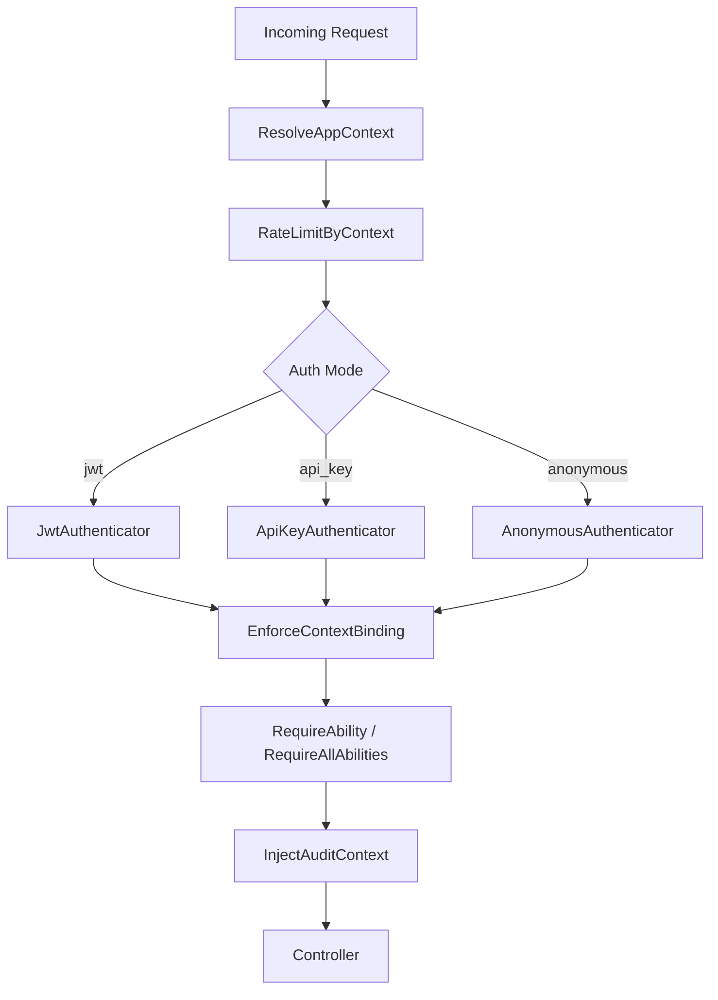

# Architecture

## Visión general
La arquitectura se organiza en capas: **resolución de contexto**, **autenticación**, **binding**, **autorización**, **rate limiting** y **audit logging**. El pipeline de middleware asegura el orden correcto para construir y enriquecer el `AppContext`.

## Componentes principales
- **ContextResolver**: resuelve canal desde host/path.
- **AppContext**: value object inmutable con identidad + permisos.
- **Authenticators**: JWT, API Key, Anonymous.
- **Verifiers**: validación de JWT y API Key.
- **Repositories**: config o DB (Eloquent).
- **Middleware**: orquesta el pipeline y aplica binding/rate limit/audit.

## Diagrama textual del pipeline
```
Incoming Request
  -> ResolveAppContext (host/path)
  -> RateLimitByContext
  -> AuthenticateChannel (jwt/api_key/anonymous)
  -> EnforceContextBinding (aud + tenant)
  -> RequireAbility (per-route)
  -> InjectAuditContext
  -> Controller
```

## Diagrama (Mermaid)


## Evidence
- File: src/AppContextServiceProvider.php
  - Symbol: AppContextServiceProvider::registerMiddleware(), AppContextServiceProvider::registerAuthenticators(), AppContextServiceProvider::registerVerifiers()
  - Notes: registra pipeline y componentes.
- File: src/Middleware/ResolveAppContext.php
  - Symbol: ResolveAppContext::handle()
  - Notes: resolución inicial de contexto.
- File: src/Middleware/RateLimitByContext.php
  - Symbol: RateLimitByContext::handle()
  - Notes: rate limiting basado en contexto.
- File: src/Middleware/AuthenticateChannel.php
  - Symbol: AuthenticateChannel::handle()
  - Notes: autenticación según `auth_mode`.
- File: src/Middleware/EnforceContextBinding.php
  - Symbol: EnforceContextBinding::handle()
  - Notes: binding de audience/tenant.
- File: src/Middleware/InjectAuditContext.php
  - Symbol: InjectAuditContext::handle()
  - Notes: logging con contexto.
